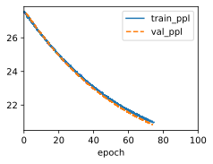

```python
!jupyter nbconvert --to markdown 9_7_4_Exercises.ipynb
```


```python
import sys
import torch.nn as nn
import torch
import warnings
from sklearn.model_selection import ParameterGrid
sys.path.append('/home/jovyan/work/d2l_solutions/notebooks/exercises/d2l_utils/')
import d2l
from torchsummary import summary
warnings.filterwarnings("ignore")
```

    /home/jovyan/work/d2l_solutions/notebooks/exercises/d2l_utils/d2l.py:129: SyntaxWarning: assertion is always true, perhaps remove parentheses?
      assert(self, 'net'), 'Neural network is defined'
    /home/jovyan/work/d2l_solutions/notebooks/exercises/d2l_utils/d2l.py:133: SyntaxWarning: assertion is always true, perhaps remove parentheses?
      assert(self, 'trainer'), 'trainer is not inited'


# 1. Adjust the hyperparameters and analyze their influence on running time, perplexity, and the output sequence.


```python
class LSTM(d2l.RNN):
    def __init__(self, num_inputs, num_hiddens):
        d2l.Module.__init__(self)
        self.save_hyperparameters()
        self.rnn = nn.LSTM(num_inputs, num_hiddens)

    def forward(self, inputs, H_C=None):
        return self.rnn(inputs, H_C)
    
def stat_val(model, data):
    ppls = []
    for batch in iter(data.get_dataloader(False)):
        ppls.append(model.validation_step(batch, plot_flag=False).detach().numpy())
    return np.exp(np.mean(ppls))

def experient(data_class=d2l.TimeMachine, num_steps=32, num_hiddens=32, lr=1):
    data = data_class(batch_size=1024, num_steps=num_steps)
    lstm = LSTM(num_inputs=len(data.vocab), num_hiddens=num_hiddens)
    model = d2l.RNNLM(lstm, vocab_size=len(data.vocab), lr=lr)
    trainer = d2l.Trainer(max_epochs=100, gradient_clip_val=1) #, num_gpus=1
    trainer.fit(model, data)
    return stat_val(model, data)
```


```python
param_grid = {'num_steps':[8, 16, 32, 64, 128],
              'num_hiddens':[8, 16, 32, 64, 128],
              'lr':[0.01,0.1,1,10]}
param_grid_obj = ParameterGrid(param_grid)
ppls = []
for params in param_grid_obj:
    ppl = experient(**params)
    ppls.append(ppl)
    print(params, ppl)
```


    

    


# 2. How would you need to change the model to generate proper words rather than just sequences of characters?


```python
class WordTimeMachine(d2l.TimeMachine): 
    def _tokenize(self, text):
        return text.split(' ')
```


```python
experient(data_class=WordTimeMachine)
```

# 3. Compare the computational cost for GRUs, LSTMs, and regular RNNs for a given hidden dimension. Pay special attention to the training and inference cost.


# 4. Since the candidate memory cell ensures that the value range is between -1 and 1 by using the tanh function, why does the hidden state need to use the tanh function again to ensure that the output value range is between -1 and 1?

The hidden state of an LSTM cell is the output that is passed to the next layer or the next time step. Therefore, it needs to have a consistent range of values that can be easily processed by other layers or cells. The tanh function ensures that the hidden state is bounded between -1 and 1, which is a common range for many activation functions and neural network operations. Moreover, the tanh function is a nonlinear function that can introduce some complexity and diversity to the hidden state, which can help the network learn more complex patterns and features. The tanh function also has a nice property that its derivative is easy to compute and does not suffer from the vanishing gradient problem as much as other functions like sigmoid.

Some sources suggest that the tanh function for the hidden state is not necessary and can be replaced by other functions or even omitted¹². However, this may depend on the specific task and data that the LSTM network is trying to model. In general, the tanh function for the hidden state is a reasonable choice that has been widely used and proven to work well in many applications.


- (1) What is the intuition of using tanh in LSTM? - Stack Overflow. https://stackoverflow.com/questions/40761185/what-is-the-intuition-of-using-tanh-in-lstm.
- (2) Keras documentation: LSTM layer. https://keras.io/api/layers/recurrent_layers/lstm/.
- (3) Why is there tanh(x)*sigmoid(x) in a LSTM cell?. https://ai.stackexchange.com/questions/32505/why-is-there-tanhxsigmoidx-in-a-lstm-cell.
- (4) What is the intuition of using tanh in LSTM? - 9to5Answer. https://9to5answer.com/what-is-the-intuition-of-using-tanh-in-lstm.

# 5. Implement an LSTM model for time series prediction rather than character sequence prediction.


```python
class Data(d2l.DataModule):
    def __init__(self, batch_size=16, T=1000, num_train=600, tau=4, randn=0.2):
        self.save_hyperparameters()
        self.time = torch.range(1, T, dtype=torch.float32)
        self.x = torch.sin(0.01*self.time) + torch.randn(T)*randn
        
    def get_dataloader(self, train):
        features = [self.x[i:self.T-self.tau+i] for i in range(self.tau)]
        self.features = torch.stack(features, 1)
        self.labels = self.x[self.tau:].reshape((-1, 1))
        i = slice(0, self.num_train) if train else slice(self.num_train, None)
        return self.get_tensorloader([self.features, self.labels], train, i)
    
class RNNAutoRegression(d2l.LinearRegression):  #@save
    """The RNN-based language model implemented with high-level APIs."""
    def init_params(self):
        self.linear = nn.LazyLinear(1)

    # def output_layer(self, hiddens):
    #     return self.linear(hiddens).swapaxes(0, 1)
    
    def __init__(self, rnn,lr=0.01, tau=4, plot_flag=True, emb_len=8):
        super().__init__(lr=lr)
        self.save_hyperparameters()
        self.init_params()   

    def forward(self, X, state=None):
        rnn_outputs, _ = self.rnn(X, state)
        return self.linear(rnn_outputs)
        # return rnn_outputs
```


```python
tau=4
data = Data(tau=tau)
lstm = LSTM(num_inputs=tau, num_hiddens=8)
model = RNNAutoRegression(rnn=lstm, lr=0.01)
trainer = d2l.Trainer(max_epochs=5)
trainer.fit(model, data)
```


```python
onestep_preds = model(data.features).detach().numpy()
d2l.plot(data.time[data.tau:], [data.labels, onestep_preds], 'time', 'x',
         legend=['labels', '1-step preds'], figsize=(6, 3))
```
