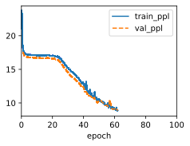

# 1. Replace the GRU by an LSTM and compare the accuracy and training speed.


```python
import sys
import torch.nn as nn
import torch
import warnings
sys.path.append('/home/jovyan/work/d2l_solutions/notebooks/exercises/d2l_utils/')
import d2l
from torchsummary import summary
warnings.filterwarnings("ignore")
from sklearn.model_selection import ParameterGrid

class LSTM(d2l.RNN):  #@save
    """The multilayer GRU model."""
    def __init__(self, num_inputs, num_hiddens, num_layers, dropout=0):
        d2l.Module.__init__(self)
        self.save_hyperparameters()
        self.rnn = nn.LSTM(num_inputs, num_hiddens, num_layers,
                          dropout=dropout)
```


```python
data = d2l.TimeMachine(batch_size=1024, num_steps=32)
lstm = LSTM(num_inputs=len(data.vocab), num_hiddens=32, num_layers=2)
model = d2l.RNNLM(lstm, vocab_size=len(data.vocab), lr=2)
trainer = d2l.Trainer(max_epochs=100, gradient_clip_val=1)
trainer.fit(model, data)
```


    

    


# 2. Increase the training data to include multiple books. How low can you go on the perplexity scale?


```python
def hash_file(fname):
    if os.path.exists(fname):
        sha1 = hashlib.sha1()
        with open(fname, 'rb') as f:
            while True:
                data = f.read(1048576)
                if not data:
                    break
                sha1.update(data)
        return sha1.hexdigest()
    
class Book(d2l.DataModule):
    def _download(self):
        fname = d2l.download(self.url, self.root, hash_file(os.path.join(self.root, self.url.split('/')[-1])))
        with open(fname) as f:
            return f.read()
        
    def __init__(self, url, batch_size, num_steps, num_train=10000, num_val=5000):
        """Defined in :numref:`sec_language-model`"""
        super().__init__()
        self.save_hyperparameters()
        corpus, self.vocab = self.build(self._download())
        array = torch.tensor([corpus[i:i+num_steps+1]
                            for i in range(len(corpus)-num_steps)])
        self.X, self.Y = array[:,:-1], array[:,1:]
        
    def _preprocess(self, text):
        return re.sub('[^A-Za-z]+', ' ', text).lower()

    def _tokenize(self, text):
        return list(text)
    
    def build(self, raw_text, vocab=None):
        tokens = self._tokenize(self._preprocess(raw_text))
        if vocab is None: vocab = d2l.Vocab(tokens)
        corpus = [vocab[token] for token in tokens]
        return corpus, vocab
        
    def get_dataloader(self, train):
        """Defined in :numref:`subsec_partitioning-seqs`"""
        idx = slice(0, self.num_train) if train else slice(
            self.num_train, self.num_train + self.num_val)
        return self.get_tensorloader([self.X, self.Y], train, idx)
        
    
class MulBooks(d2l.DataModule):
    def __init__(self, books):
        x_list = []
        y_list = []
        self.num_train = 0
        self.num_val = 0
        for book in books:
            x_list.append(book.X)
            y_list.append(book.Y)
            self.num_train += book.num_train
            self.num_val += book.num_val
        
    def get_dataloader(self, train):
        """Defined in :numref:`subsec_partitioning-seqs`"""
        idx = slice(0, self.num_train) if train else slice(
            self.num_train, self.num_train + self.num_val)
        return self.get_tensorloader([self.X, self.Y], train, idx)
```


```python
urls = ['https://www.gutenberg.org/cache/epub/36/pg36.txt','https://www.gutenberg.org/cache/epub/71557/pg71557.txt','http://d2l-data.s3-accelerate.amazonaws.com/timemachine.txt']
books = [Book(url=url, batch_size=1024, num_steps=32) for url in urls]
data = MulBooks(books)
lstm = LSTM(num_inputs=len(data.vocab), num_hiddens=32, num_layers=2)
model = d2l.RNNLM(lstm, vocab_size=len(data.vocab), lr=2)
trainer = d2l.Trainer(max_epochs=100, gradient_clip_val=1)
trainer.fit(model, data)
```

# 3. Would you want to combine sources of different authors when modeling text? Why is this a good idea? What could go wrong?
