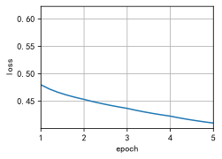
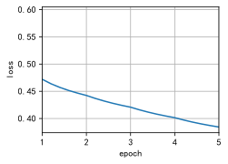
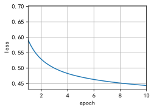

# 1. Using the trained model, find semantically similar words for other input words. Can you improve the results by tuning hyperparameters?


```python
import time
import collections
import math
import os
import random
import torch
import warnings
import sys
import pandas as pd
import torch
import torch.nn as nn
sys.path.append('/home/jovyan/work/d2l_solutions/notebooks/exercises/d2l_utils/')
import d2l
from torchsummary import summary
warnings.filterwarnings("ignore")

#@save
d2l.DATA_HUB['ptb'] = (d2l.DATA_URL + 'ptb.zip',
                       '319d85e578af0cdc590547f26231e4e31cdf1e42')
#@save
class RandomGenerator:
    """Randomly draw among {1, ..., n} according to n sampling weights."""
    def __init__(self, sampling_weights,k=10000):
        # Exclude
        self.population = list(range(1, len(sampling_weights) + 1))
        self.sampling_weights = sampling_weights
        self.candidates = []
        self.i = 0
        self.k = k

    def draw(self):
        if self.i == len(self.candidates):
            # Cache `k` random sampling results
            self.candidates = random.choices(
                self.population, self.sampling_weights, k=self.k)
            self.i = 0
        self.i += 1
        return self.candidates[self.i - 1]
    
#@save
def subsample(sentences, vocab,flag=True):
    """Subsample high-frequency words."""
    # Exclude unknown tokens ('<unk>')
    sentences = [[token for token in line if vocab[token] != vocab.unk]
                 for line in sentences]
    counter = collections.Counter([
        token for line in sentences for token in line])
    num_tokens = sum(counter.values())

    # Return True if `token` is kept during subsampling
    def keep(token):
        return(random.uniform(0, 1) <
               math.sqrt(1e-4 / counter[token] * num_tokens))
    if flag:
        return ([[token for token in line if keep(token)] for line in sentences],
            counter)
    return (sentences,counter)

#@save
def get_centers_and_contexts(corpus, max_window_size):
    """Return center words and context words in skip-gram."""
    centers, contexts = [], []
    for line in corpus:
        # To form a "center word--context word" pair, each sentence needs to
        # have at least 2 words
        if len(line) < 2:
            continue
        centers += line
        for i in range(len(line)):  # Context window centered at `i`
            window_size = random.randint(1, max_window_size)
            indices = list(range(max(0, i - window_size),
                                 min(len(line), i + 1 + window_size)))
            # Exclude the center word from the context words
            indices.remove(i)
            contexts.append([line[idx] for idx in indices])
    return centers, contexts

#@save
def read_ptb():
    """Load the PTB dataset into a list of text lines."""
    data_dir = d2l.download_extract('ptb')
    # Read the training set
    with open(os.path.join(data_dir, 'ptb.train.txt')) as f:
        raw_text = f.read()
    return [line.split() for line in raw_text.split('\n')]

#@save
def get_negatives(all_contexts, vocab, counter, K, k=10000):
    """Return noise words in negative sampling."""
    # Sampling weights for words with indices 1, 2, ... (index 0 is the
    # excluded unknown token) in the vocabulary
    sampling_weights = [counter[vocab.to_tokens(i)]**0.75
                        for i in range(1, len(vocab))]
    all_negatives, generator = [], RandomGenerator(sampling_weights,k)
    for contexts in all_contexts:
        negatives = []
        while len(negatives) < len(contexts) * K:
            neg = generator.draw()
            # Noise words cannot be context words
            if neg not in contexts:
                negatives.append(neg)
        all_negatives.append(negatives)
    return all_negatives

#@save
def batchify(data):
    """Return a minibatch of examples for skip-gram with negative sampling."""
    max_len = max(len(c) + len(n) for _, c, n in data)
    centers, contexts_negatives, masks, labels = [], [], [], []
    for center, context, negative in data:
        cur_len = len(context) + len(negative)
        centers += [center]
        contexts_negatives += [context + negative + [0] * (max_len - cur_len)]
        masks += [[1] * cur_len + [0] * (max_len - cur_len)]
        labels += [[1] * len(context) + [0] * (max_len - len(context))]
    return (torch.tensor(centers).reshape((-1, 1)), torch.tensor(
        contexts_negatives), torch.tensor(masks), torch.tensor(labels))

#@save
def load_data_ptb(batch_size, max_window_size, num_noise_words, flag=True, k=10000):
    """Download the PTB dataset and then load it into memory."""
    # num_workers = d2l.get_dataloader_workers()
    sentences = read_ptb()
    vocab = d2l.Vocab(sentences, min_freq=10)
    subsampled, counter = subsample(sentences, vocab, flag)
    corpus = [vocab[line] for line in subsampled]
    all_centers, all_contexts = get_centers_and_contexts(
        corpus, max_window_size)
    all_negatives = get_negatives(
        all_contexts, vocab, counter, num_noise_words, k=k)

    class PTBDataset(torch.utils.data.Dataset):
        def __init__(self, centers, contexts, negatives):
            assert len(centers) == len(contexts) == len(negatives)
            self.centers = centers
            self.contexts = contexts
            self.negatives = negatives

        def __getitem__(self, index):
            return (self.centers[index], self.contexts[index],
                    self.negatives[index])

        def __len__(self):
            return len(self.centers)

    dataset = PTBDataset(all_centers, all_contexts, all_negatives)

    data_iter = torch.utils.data.DataLoader(dataset, batch_size, shuffle=True,
                                      collate_fn=batchify)
    return data_iter, vocab

def skip_gram(center, contexts_and_negatives, embed_v, embed_u):
    v = embed_v(center)
    u = embed_u(contexts_and_negatives)
    pred = torch.bmm(v, u.permute(0, 2, 1))
    return pred

class SigmoidBCELoss(nn.Module):
    # Binary cross-entropy loss with masking
    def __init__(self):
        super().__init__()

    def forward(self, inputs, target, mask=None):
        out = nn.functional.binary_cross_entropy_with_logits(
            inputs, target, weight=mask, reduction="none")
        return out.mean(dim=1)

def train(net, data_iter, lr, num_epochs, device='cpu'):
    def init_weights(module):
        if type(module) == nn.Embedding:
            nn.init.xavier_uniform_(module.weight)
    net.apply(init_weights)
    net = net.to(device)
    optimizer = torch.optim.Adam(net.parameters(), lr=lr)
    animator = d2l.Animator(xlabel='epoch', ylabel='loss',
                            xlim=[1, num_epochs])
    # Sum of normalized losses, no. of normalized losses
    metric = d2l.Accumulator(2)
    loss = SigmoidBCELoss()
    for epoch in range(num_epochs):
        timer, num_batches = d2l.Timer(), len(data_iter)
        for i, batch in enumerate(data_iter):
            optimizer.zero_grad()
            center, context_negative, mask, label = [
                data.to(device) for data in batch]

            pred = skip_gram(center, context_negative, net[0], net[1])
            l = (loss(pred.reshape(label.shape).float(), label.float(), mask)
                     / mask.sum(axis=1) * mask.shape[1])
            l.sum().backward()
            optimizer.step()
            metric.add(l.sum(), l.numel())
            if (i + 1) % (num_batches // 5) == 0 or i == num_batches - 1:
                animator.add(epoch + (i + 1) / num_batches,
                             (metric[0] / metric[1],))
    print(f'loss {metric[0] / metric[1]:.3f}, '
          f'{metric[1] / timer.stop():.1f} tokens/sec on {str(device)}')
    return metric[0] / metric[1]

def get_similar_tokens(query_token, k, embed):
    W = embed.weight.data
    x = W[vocab[query_token]]
    # Compute the cosine similarity. Add 1e-9 for numerical stability
    cos = torch.mv(W, x) / torch.sqrt(torch.sum(W * W, dim=1) *
                                      torch.sum(x * x) + 1e-9)
    topk = torch.topk(cos, k=k+1)[1].cpu().numpy().astype('int32')
    for i in topk[1:]:  # Remove the input words
        print(f'cosine sim={float(cos[i]):.3f}: {vocab.to_tokens(i)}')
```


```python
data_iter, vocab = load_data_ptb(512, 5, 5)
lr, num_epochs = 0.002, 5
embed_size = 100
net = nn.Sequential(nn.Embedding(num_embeddings=len(vocab),
                                 embedding_dim=embed_size),
                    nn.Embedding(num_embeddings=len(vocab),
                                 embedding_dim=embed_size))
train(net, data_iter, lr, num_epochs)
```

    loss 0.410, 55995.3 tokens/sec on cpu


    

    


```python
lr, num_epochs = 0.002, 5
embed_size = 200
net = nn.Sequential(nn.Embedding(num_embeddings=len(vocab),
                                 embedding_dim=embed_size),
                    nn.Embedding(num_embeddings=len(vocab),
                                 embedding_dim=embed_size))
train(net, data_iter, lr, num_epochs)
```

    loss 0.384, 36166.7 tokens/sec on cpu


    0.3843912484866804


    

    


```python
get_similar_tokens('intel', 3, net[0])
```

    cosine sim=0.551: workstations
    cosine sim=0.537: microprocessor
    cosine sim=0.525: compaq


# 2. When a training corpus is huge, we often sample context words and noise words for the center words in the current minibatch when updating model parameters. In other words, the same center word may have different context words or noise words in different training epochs. What are the benefits of this method? Try to implement this training method.

The benefit of sampling context words and noise words is that it allows the model to capture more information from different contexts and handle larger training corpora. By varying the context words and noise words for the same center word in different epochs, the model can learn more diverse and robust representations of words that reflect their meanings in various situations4. This can also help the model avoid overfitting to a specific context or corpus.


```python
import os
import random

class Vocab:
    """Vocabulary for text."""
    def __init__(self, filename, min_freq=0, reserved_tokens=[]):
        # Flatten a 2D list if needed
        # if tokens and isinstance(tokens[0], list):
        #     tokens = [token for line in tokens for token in line]
        self.token_freqs = collections.Counter([])
        with open(filename, 'rb') as f:
            for line in f:
                counter = collections.Counter(line.decode().strip().split())
                self.token_freqs.update(counter)
        # Count token frequencies
        
        # counter = collections.Counter(tokens)
        # self.token_freqs = sorted(counter.items(), key=lambda x: x[1],
        #                           reverse=True)
        # The list of unique tokens
        filter_tokens = list(set(['<unk>'] + reserved_tokens + [
            token for token in self.token_freqs if self.token_freqs[token] >= min_freq]))
        self.idx_to_token = {}
        self.token_to_idx = {}
        for idx, token in enumerate(filter_tokens):
            self.idx_to_token[idx]=token
            self.token_to_idx[token]=idx
        self.cur_id = len(self.idx_to_token)

    def __len__(self):
        return len(self.idx_to_token)

    def __getitem__(self, tokens):
        if not isinstance(tokens, (list, tuple)):
            return self.token_to_idx.get(tokens, self.unk)
        return [self.__getitem__(token) for token in tokens]

    def to_tokens(self, indices):
        if hasattr(indices, '__len__') and len(indices) > 1:
            return [self.idx_to_token[int(index)] for index in indices]
        return self.idx_to_token[indices]
    
    def update(self, tokens):
        # 统计tokens中每个词的出现次数，并更新到原有的词频字典中
        counter = collections.Counter(tokens)
        self.token_freqs.update(counter)
        # 遍历新出现的词，给每个词分配一个id，并更新两个映射字典
        for token in counter:
            if token not in self.token_to_idx:
                self.token_to_idx[token] = self.cur_id
                self.idx_to_token[self.cur_id] = token
                self.cur_id += 1
    
    @property
    def unk(self):  # Index for the unknown token
        return self.token_to_idx['<unk>']


def get_random_line(filepath,n):
    file_size = os.path.getsize(filepath)
    res = []
    row = 0
    with open(filepath, 'rb') as f:
        while True:
            pos = random.randint(0, file_size)
            if not pos:  # the first line is chosen
                return res  # return str
            f.seek(pos)  # seek to random position
            f.readline()  # skip possibly incomplete line
            line = f.readline()  # read next (full) line
            if line:
                res.append(line.decode().strip().split())
                row += 1
                if row >= n:
                    return res
                
#@save
def subsample(sentences, vocab,flag=True):
    """Subsample high-frequency words."""
    # Exclude unknown tokens ('<unk>')
    sentences = [[token for token in line if vocab[token] != vocab.unk]
                 for line in sentences]
    # print(sentences)
    counter = collections.Counter([
        token for line in sentences for token in line])
    num_tokens = sum(counter.values())

    # Return True if `token` is kept during subsampling
    def keep(token):
        # print(token, counter[token]/num_tokens,math.sqrt(1e-4 / counter[token] * num_tokens))
        return(random.uniform(0, 1) <
               math.sqrt(1e-4 / counter[token] * num_tokens))
    if flag:
        return ([[token for token in line if keep(token)] for line in sentences],
            counter)
    return (sentences,counter)

def batchify(all_centers, all_contexts,all_negatives):
    """Return a minibatch of examples for skip-gram with negative sampling."""
    max_len = max(len(c) + len(n) for _, c, n in data)
    centers, contexts_negatives, masks, labels = [], [], [], []
    for center, context, negative in zip(all_centers, all_contexts,all_negatives):
        cur_len = len(context) + len(negative)
        centers += [center]
        contexts_negatives += [context + negative + [0] * (max_len - cur_len)]
        masks += [[1] * cur_len + [0] * (max_len - cur_len)]
        labels += [[1] * len(context) + [0] * (max_len - len(context))]
    # print(contexts_negatives)
    return (torch.tensor(centers).reshape((-1, 1)), torch.tensor(
        contexts_negatives), torch.tensor(masks), torch.tensor(labels))

def random_batch(filename,vocab,n,max_window_size,num_noise_words):
    sentences = get_random_line(filename,n)
    subsampled, counter = subsample(sentences, vocab, False)
    corpus = [vocab[line] for line in subsampled]
    all_centers, all_contexts = get_centers_and_contexts(
        corpus, max_window_size)
    all_negatives = get_negatives(all_contexts, vocab, counter, num_noise_words, k=100)
    return batchify(all_centers, all_contexts,all_negatives)

def train(net, filename,vocab,n ,max_window_size,num_noise_words,lr, num_epochs, num_batches, device='cpu'):
    def init_weights(module):
        if type(module) == nn.Embedding:
            nn.init.xavier_uniform_(module.weight)
    net.apply(init_weights)
    net = net.to(device)
    optimizer = torch.optim.Adam(net.parameters(), lr=lr)
    animator = d2l.Animator(xlabel='epoch', ylabel='loss',
                            xlim=[1, num_epochs])
    # Sum of normalized losses, no. of normalized losses
    metric = d2l.Accumulator(2)
    loss = SigmoidBCELoss()
    for epoch in range(num_epochs):
        timer = d2l.Timer()
        for i in range(num_batches):
            optimizer.zero_grad()
            center, context_negative, mask, label = random_batch(filename,vocab,n,max_window_size,num_noise_words)
            pred = skip_gram(center, context_negative, net[0], net[1])
            l = (loss(pred.reshape(label.shape).float(), label.float(), mask)
                     / mask.sum(axis=1) * mask.shape[1])
            l.sum().backward()
            optimizer.step()
            metric.add(l.sum(), l.numel())
            if (i + 1) % (num_batches // 5) == 0 or i == num_batches - 1:
                animator.add(epoch + (i + 1) / num_batches,
                             (metric[0] / metric[1],))
    print(f'loss {metric[0] / metric[1]:.3f}, '
          f'{metric[1] / timer.stop():.1f} tokens/sec on {str(device)}')
    return metric[0] / metric[1]
```


```python
data_dir = d2l.download_extract('ptb')
filename = os.path.join(data_dir, 'ptb.train.txt')
vocab = Vocab(filename=filename)
# sentences = get_random_line(filename,100)
# sentences
```


```python
# data_iter, vocab = load_data_ptb(512, 5, 5)
lr, num_epochs = 0.002, 10
embed_size = 100
n = 100
max_window_size = 5
num_noise_words = 5
num_batches = 100
net = nn.Sequential(nn.Embedding(num_embeddings=len(vocab),
                                 embedding_dim=embed_size),
                    nn.Embedding(num_embeddings=len(vocab),
                                 embedding_dim=embed_size))
# train(net, data_iter, lr, num_epochs)
train(net, filename,vocab,n,max_window_size,num_noise_words, lr, num_epochs, num_batches)
```

    loss 0.444, 24885.4 tokens/sec on cpu


    0.4439971089160742


    

    


```python
get_similar_tokens('intel', 3, net[0])
```

    cosine sim=0.981: lighting
    cosine sim=0.977: reliance
    cosine sim=0.976: vanguard

