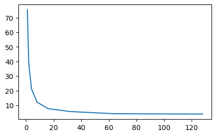

```python
import sys
import time
import torch
import torchvision
from torchvision import transforms
import warnings
import matplotlib.pyplot as plt
import cProfile
sys.path.append('/home/jovyan/work/d2l_solutions/notebooks/exercises/d2l_utils/')
import d2l
warnings.filterwarnings("ignore")


class FashionMNIST(d2l.DataModule):  #@save
    """The Fashion-MNIST dataset."""
    def __init__(self, batch_size=64, resize=(28, 28)):
        super().__init__()
        self.save_hyperparameters()
        trans = transforms.Compose([transforms.Resize(resize),
                                    transforms.ToTensor()])
        self.train = torchvision.datasets.FashionMNIST(
            root=self.root, train=True, transform=trans, download=True)
        self.val = torchvision.datasets.FashionMNIST(
            root=self.root, train=False, transform=trans, download=True)

    def text_labels(self, indices):
        """Return text labels."""
        labels = ['t-shirt', 'trouser', 'pullover', 'dress', 'coat',
                  'sandal', 'shirt', 'sneaker', 'bag', 'ankle boot']
        return [labels[int(i)] for i in indices]
        
    def get_dataloader(self, train):
        data = self.train if train else self.val
        return torch.utils.data.DataLoader(data, self.batch_size, shuffle=train
                                           , num_workers=self.num_workers)


def load_time(data):
    tic = time.time()
    for X, y in data.train_dataloader():
        continue
    return time.time() - tic
```


```python
data = FashionMNIST(resize=(32, 32))
len(data.train), len(data.val)
```


    (60000, 10000)


```python
X, y = next(iter(data.train_dataloader()))
print(X.shape, X.dtype, y.shape, y.dtype)
```

    torch.Size([64, 1, 32, 32]) torch.float32 torch.Size([64]) torch.int64


```python
f'{load_time(data):.2f} sec'
```


    '4.30 sec'


# 4.2.5. Exercises

## 1. Does reducing the batch_size (for instance, to 1) affect the reading performance?

Reducing the batch size in machine learning, particularly during training, can indeed affect the reading performance and overall training dynamics. Here's how it can impact different aspects:

**Reading Performance:**
When the batch size is reduced, the number of examples processed together in each iteration decreases. This can lead to an increase in the frequency of data loading and preprocessing operations, which may affect reading performance in the following ways:

1. **Higher Overhead:** Smaller batch sizes result in more frequent data loading, which can increase overhead due to data loading and preprocessing operations. This might lead to slower training if these operations take a significant amount of time.

2. **I/O and Disk Access:** Frequent data loading can put a strain on I/O systems, particularly in cases where data needs to be fetched from disk or over a network. Disk access latency and bandwidth limitations might become more pronounced with smaller batch sizes.


```python
batches = d2l.gen_logrithm_nums(initial_value=1, growth_factor=2,
                                num_elements=8)
ts = [load_time(FashionMNIST(batch_size=batch, resize=(32, 32))) 
      for batch in batches]
plt.figure(figsize=(5, 3))
plt.plot(batches, ts)
plt.show()
```


    

    


## 2. The data iterator performance is important. Do you think the current implementation is fast enough? Explore various options to improve it. Use a system profiler to find out where the bottlenecks are.

{method '**poll**' of 'select.poll' objects} is the main bottleleneck. And we have some aspects to help improving Data Iterator Performance:
1. **Batching and Prefetching:** Implement batching and prefetching mechanisms to load and preprocess data in parallel. This can help overlap data loading with model computation, reducing overall training time.

2. **Parallelism:** Utilize multi-threading or multiprocessing to load and preprocess data in parallel. Libraries like TensorFlow's `tf.data` and PyTorch's `DataLoader` offer options to achieve this.

3. **Data Format:** Use efficient data formats like TFRecords or binary formats that can be read faster compared to text-based formats.

4. **Caching:** Cache preprocessed data to avoid redundant preprocessing during each epoch. This can be especially beneficial if data preprocessing is complex and time-consuming.

5. **Data Shuffling:** Shuffle the data at the beginning of each epoch to improve convergence speed and reduce potential bias in gradient updates.

6. **I/O Optimizations:** Minimize I/O operations by reading larger chunks of data at once, reducing the overhead associated with frequent small reads.


```python
profiler = cProfile.Profile()
profiler.enable()
# Call the function you want to profile
load_time(data)
profiler.disable()
profiler.print_stats(sort="tottime")
```

             509245 function calls (509239 primitive calls) in 6.032 seconds
    
       Ordered by: internal time
    
       ncalls  tottime  percall  cumtime  percall filename:lineno(function)
          942    3.831    0.004    3.831    0.004 {method 'poll' of 'select.poll' objects}
        13132    0.623    0.000    0.623    0.000 {built-in method posix.read}
         1876    0.159    0.000    0.159    0.000 {method 'recvmsg' of '_socket.socket' objects}
            1    0.097    0.097    6.032    6.032 1668487492.py:38(load_time)
         1876    0.071    0.000    0.071    0.000 {method 'connect' of '_socket.socket' objects}
         7504    0.066    0.000    0.066    0.000 {built-in method posix.write}
          938    0.057    0.000    1.719    0.002 {built-in method _pickle.loads}
         1876    0.051    0.000    0.051    0.000 {built-in method torch.tensor}
            4    0.047    0.012    0.047    0.012 {built-in method posix.fork}
        13132    0.042    0.000    0.675    0.000 connection.py:373(_recv)
          939    0.041    0.000    0.041    0.000 {built-in method torch._ops.profiler.}
         3752    0.038    0.000    0.038    0.000 socket.py:220(__init__)
         1876    0.030    0.000    0.030    0.000 {built-in method _new_shared_fd_cpu}
         1876    0.025    0.000    1.176    0.001 resource_sharer.py:81(get_connection)
         6566    0.025    0.000    0.709    0.000 connection.py:412(_recv_bytes)
         1876    0.024    0.000    0.024    0.000 {method 'set_' of 'torch._C._TensorBase' objects}
         1876    0.023    0.000    0.185    0.000 reduction.py:153(recvfds)
         5628    0.023    0.000    0.103    0.000 connection.py:181(send_bytes)
          939    0.022    0.000    0.022    0.000 {built-in method torch._ops.profiler._record_function_enter_new}
          953    0.021    0.000    0.021    0.000 {method 'release' of '_thread.lock' objects}
         3752    0.021    0.000    0.021    0.000 {built-in method posix.fstat}
         1876    0.020    0.000    0.643    0.000 connection.py:746(answer_challenge)
         1876    0.020    0.000    0.135    0.000 connection.py:622(SocketClient)
         1876    0.020    0.000    1.546    0.001 reductions.py:306(rebuild_storage_fd)
         1876    0.020    0.000    0.038    0.000 reduction.py:38(__init__)
         3752    0.020    0.000    0.020    0.000 {built-in method _hashlib.hmac_new}
          940    0.019    0.000    0.038    0.000 sampler.py:241(__iter__)
         3770    0.017    0.000    0.017    0.000 {built-in method posix.close}
         1876    0.017    0.000    0.017    0.000 {method 'update' of 'dict' objects}
         7504    0.015    0.000    0.096    0.000 connection.py:389(_send_bytes)
         1876    0.015    0.000    0.265    0.000 connection.py:731(deliver_challenge)
         6566    0.015    0.000    0.728    0.000 connection.py:207(recv_bytes)
         1018    0.014    0.000    0.014    0.000 {method 'acquire' of '_thread.lock' objects}
         1876    0.013    0.000    0.226    0.000 reduction.py:186(recv_handle)
          939    0.012    0.000    5.836    0.006 dataloader.py:628(__next__)
         1876    0.012    0.000    1.065    0.001 connection.py:492(Client)
          939    0.011    0.000    5.737    0.006 dataloader.py:1298(_next_data)
         1876    0.011    0.000    1.433    0.001 resource_sharer.py:55(detach)
         1876    0.010    0.000    0.094    0.000 reductions.py:98(rebuild_tensor)
         1876    0.010    0.000    0.022    0.000 reductions.py:339(rebuild_typed_storage)
          942    0.010    0.000    3.878    0.004 connection.py:916(wait)
          939    0.010    0.000    0.053    0.000 profiler.py:495(__exit__)
          942    0.010    0.000    3.843    0.004 selectors.py:402(select)
          958    0.010    0.000    0.010    0.000 {method '__enter__' of '_thread.lock' objects}
          938    0.010    0.000    5.614    0.006 queues.py:98(get)
        60001    0.010    0.000    0.019    0.000 sampler.py:117(__iter__)
         3752    0.010    0.000    0.040    0.000 hmac.py:38(__init__)
         3752    0.009    0.000    0.029    0.000 hmac.py:66(_init_hmac)
    44264/44259    0.009    0.000    0.009    0.000 {built-in method builtins.len}
         1876    0.008    0.000    0.084    0.000 _utils.py:145(_rebuild_tensor)
         1876    0.008    0.000    0.053    0.000 reduction.py:48(dumps)
         3752    0.008    0.000    0.008    0.000 {method 'digest' of '_hashlib.HMAC' objects}
         6566    0.008    0.000    0.008    0.000 {built-in method _struct.unpack}
         1876    0.008    0.000    0.009    0.000 reductions.py:65(get)
          946    0.007    0.000    0.104    0.000 dataloader.py:1347(_try_put_index)
         7504    0.007    0.000    0.075    0.000 connection.py:364(_send)
          942    0.007    0.000    0.056    0.000 queues.py:86(put)
         1876    0.007    0.000    0.017    0.000 reductions.py:69(__setitem__)
         3752    0.007    0.000    0.047    0.000 hmac.py:167(new)
        13132    0.006    0.000    0.006    0.000 {method 'write' of '_io.BytesIO' objects}
            2    0.006    0.003    0.006    0.003 {method 'tolist' of 'torch._C._TensorBase' objects}
         1876    0.006    0.000    0.078    0.000 connection.py:201(send)
        18780    0.005    0.000    0.006    0.000 {built-in method builtins.isinstance}
         1876    0.005    0.000    0.006    0.000 reductions.py:28(__init__)
         1876    0.005    0.000    0.005    0.000 {method 'dump' of '_pickle.Pickler' objects}
         3752    0.005    0.000    0.008    0.000 connection.py:95(address_type)
         1876    0.005    0.000    0.006    0.000 storage.py:427(__init__)
         7504    0.005    0.000    0.005    0.000 {built-in method _struct.pack}
         3752    0.005    0.000    0.026    0.000 reductions.py:291(fd_id)
        17822    0.005    0.000    0.005    0.000 connection.py:134(_check_closed)
          939    0.004    0.000    0.007    0.000 profiler.py:482(__init__)
         1876    0.004    0.000    0.004    0.000 {built-in method _socket.dup}
         1876    0.004    0.000    0.005    0.000 storage.py:355(__new__)
          942    0.004    0.000    0.010    0.000 selectors.py:234(register)
         3752    0.004    0.000    0.014    0.000 hmac.py:151(digest)
          946    0.004    0.000    0.027    0.000 threading.py:359(notify)
         1876    0.004    0.000    0.005    0.000 socket.py:505(detach)
         1876    0.004    0.000    0.017    0.000 socket.py:540(fromfd)
          939    0.004    0.000    0.027    0.000 profiler.py:491(__enter__)
           16    0.004    0.000    0.009    0.001 reductions.py:75(free_dead_references)
         3752    0.003    0.000    0.011    0.000 socket.py:239(__exit__)
          938    0.003    0.000    3.857    0.004 connection.py:422(_poll)
         1876    0.003    0.000    0.003    0.000 {method 'setblocking' of '_socket.socket' objects}
         1886    0.003    0.000    0.003    0.000 connection.py:117(__init__)
          938    0.003    0.000    5.619    0.006 dataloader.py:1265(_get_data)
        13132    0.003    0.000    0.003    0.000 {method 'getvalue' of '_io.BytesIO' objects}
         1876    0.003    0.000    0.007    0.000 socket.py:499(close)
            2    0.003    0.001    0.003    0.001 {built-in method torch.randperm}
         1876    0.003    0.000    0.003    0.000 {built-in method posix.urandom}
          942    0.003    0.000    0.006    0.000 selectors.py:347(__init__)
         1912    0.003    0.000    0.004    0.000 <frozen importlib._bootstrap>:405(parent)
         1876    0.003    0.000    0.019    0.000 connection.py:173(close)
         1876    0.003    0.000    0.003    0.000 {function socket.close at 0xffffa0d56c00}
          942    0.003    0.000    0.013    0.000 selectors.py:351(register)
          938    0.002    0.000    3.860    0.004 connection.py:252(poll)
         3752    0.002    0.000    0.002    0.000 {method 'startswith' of 'str' objects}
         1876    0.002    0.000    0.002    0.000 connection.py:83(_validate_family)
         1933    0.002    0.000    0.002    0.000 {built-in method posix.getpid}
          939    0.002    0.000    0.002    0.000 typing.py:349(inner)
         1876    0.002    0.000    0.012    0.000 reductions.py:299(storage_from_cache)
          938    0.002    0.000    5.616    0.006 dataloader.py:1119(_try_get_data)
          938    0.002    0.000    0.081    0.000 dataloader.py:1367(_process_data)
          942    0.002    0.000    0.002    0.000 selectors.py:268(close)
          958    0.002    0.000    0.012    0.000 threading.py:264(__enter__)
          942    0.002    0.000    0.004    0.000 selectors.py:21(_fileobj_to_fd)
           20    0.002    0.000    0.004    0.000 synchronize.py:50(__init__)
          942    0.002    0.000    0.002    0.000 selectors.py:209(__init__)
         7504    0.002    0.000    0.002    0.000 connection.py:138(_check_readable)
         1880    0.002    0.000    0.002    0.000 {method 'copy' of 'dict' objects}
         7504    0.002    0.000    0.002    0.000 connection.py:142(_check_writable)
         1876    0.002    0.000    0.005    0.000 socket.py:495(_real_close)
         1876    0.002    0.000    0.021    0.000 connection.py:261(__exit__)
         1876    0.002    0.000    0.002    0.000 process.py:213(authkey)
         2814    0.002    0.000    0.002    0.000 connection.py:168(fileno)
         1888    0.002    0.000    0.002    0.000 {method 'acquire' of '_multiprocessing.SemLock' objects}
         1945    0.002    0.000    0.040    0.000 {built-in method builtins.next}
         2064    0.002    0.000    0.003    0.000 reductions.py:34(expired)
          939    0.002    0.000    0.042    0.000 _ops.py:286(__call__)
         2843    0.002    0.000    0.002    0.000 {built-in method __new__ of type object at 0xaaaaafb07740}
         1912    0.002    0.000    0.002    0.000 {method 'rpartition' of 'str' objects}
         4710    0.001    0.000    0.001    0.000 {method '__exit__' of '_thread.lock' objects}
         3752    0.001    0.000    0.001    0.000 hmac.py:139(_current)
          939    0.001    0.000    0.023    0.000 _ops.py:497(__call__)
         1908    0.001    0.000    0.001    0.000 {built-in method _free_weak_ref}
         1876    0.001    0.000    0.001    0.000 {built-in method _socket.CMSG_SPACE}
         1880    0.001    0.000    0.001    0.000 {method 'get' of 'dict' objects}
            1    0.001    0.001    0.097    0.097 dataloader.py:993(__init__)
         1878    0.001    0.000    0.016    0.000 connection.py:359(_close)
          946    0.001    0.000    0.039    0.000 dataloader.py:622(_next_index)
         1876    0.001    0.000    0.001    0.000 {method '_weak_ref' of 'torch._C.StorageBase' objects}
           16    0.001    0.000    0.001    0.000 socket.py:545(send)
         1876    0.001    0.000    0.001    0.000 {method 'frombytes' of 'array.array' objects}
         1908    0.001    0.000    0.003    0.000 reductions.py:37(__del__)
          958    0.001    0.000    0.002    0.000 threading.py:279(_is_owned)
           13    0.001    0.000    0.001    0.000 {built-in method posix.pipe}
          958    0.001    0.000    0.001    0.000 threading.py:267(__exit__)
         1876    0.001    0.000    0.001    0.000 {method 'getbuffer' of '_io.BytesIO' objects}
            8    0.001    0.000    0.001    0.000 util.py:186(__init__)
         1881    0.001    0.000    0.001    0.000 {method 'release' of '_multiprocessing.SemLock' objects}
         1900    0.001    0.000    0.001    0.000 {built-in method builtins.getattr}
         2818    0.001    0.000    0.001    0.000 {built-in method time.monotonic}
          942    0.001    0.000    0.005    0.000 selectors.py:215(_fileobj_lookup)
          942    0.001    0.000    0.001    0.000 selectors.py:275(_key_from_fd)
            4    0.001    0.000    0.049    0.012 popen_fork.py:62(_launch)
          942    0.001    0.000    0.001    0.000 {built-in method select.poll}
         1896    0.001    0.000    0.001    0.000 process.py:37(current_process)
          942    0.001    0.000    0.001    0.000 <string>:1(<lambda>)
         2064    0.001    0.000    0.001    0.000 {built-in method _expired}
            5    0.001    0.000    0.007    0.001 queues.py:37(__init__)
          942    0.001    0.000    0.001    0.000 connection.py:932(<listcomp>)
          942    0.001    0.000    0.003    0.000 selectors.py:202(__exit__)
            2    0.001    0.000    0.001    0.000 {method 'random_' of 'torch._C._TensorBase' objects}
          942    0.001    0.000    0.001    0.000 {built-in method math.ceil}
         2064    0.001    0.000    0.001    0.000 storage.py:925(_expired)
            5    0.001    0.000    0.008    0.002 context.py:100(Queue)
         1908    0.001    0.000    0.002    0.000 storage.py:789(_free_weak_ref)
         1876    0.001    0.000    0.001    0.000 {function socket.detach at 0xffffa0d56ca0}
            2    0.001    0.000    0.001    0.000 {built-in method torch.empty}
          942    0.001    0.000    0.001    0.000 {method 'register' of 'select.poll' objects}
         1878    0.001    0.000    0.001    0.000 connection.py:130(__del__)
          974    0.001    0.000    0.001    0.000 {method 'append' of 'collections.deque' objects}
         3752    0.001    0.000    0.001    0.000 socket.py:236(__enter__)
          942    0.001    0.000    0.001    0.000 selectors.py:63(__init__)
            4    0.000    0.000    0.060    0.015 process.py:110(start)
            5    0.000    0.000    0.001    0.000 queues.py:71(_reset)
            1    0.000    0.000    0.000    0.000 {built-in method torch._C._set_worker_pids}
           20    0.000    0.000    0.001    0.000 random.py:480(choices)
          941    0.000    0.000    0.000    0.000 {method 'remove' of 'collections.deque' objects}
          950    0.000    0.000    0.000    0.000 {method 'append' of 'list' objects}
          939    0.000    0.000    0.000    0.000 {method '__exit__' of 'torch._C.DisableTorchFunctionSubclass' objects}
          942    0.000    0.000    0.000    0.000 {method 'clear' of 'dict' objects}
           11    0.000    0.000    0.004    0.000 context.py:65(Lock)
           16    0.000    0.000    0.001    0.000 iostream.py:243(schedule)
            8    0.000    0.000    0.009    0.001 iostream.py:547(flush)
            4    0.000    0.000    0.059    0.015 context.py:278(_Popen)
           20    0.000    0.000    0.001    0.000 tempfile.py:153(__next__)
           17    0.000    0.000    0.000    0.000 threading.py:236(__init__)
           20    0.000    0.000    0.002    0.000 synchronize.py:114(_make_name)
            4    0.000    0.000    0.000    0.000 {built-in method _thread.start_new_thread}
          541    0.000    0.000    0.000    0.000 {method 'pop' of 'dict' objects}
            5    0.000    0.000    0.001    0.000 _tensor.py:904(__len__)
         1876    0.000    0.000    0.000    0.000 connection.py:258(__enter__)
            4    0.000    0.000    0.008    0.002 queues.py:161(_start_thread)
            4    0.000    0.000    0.000    0.000 __init__.py:237(_releaseLock)
            4    0.000    0.000    0.000    0.000 process.py:80(__init__)
           25    0.000    0.000    0.000    0.000 weakref.py:164(__setitem__)
          939    0.000    0.000    0.000    0.000 _jit_internal.py:1102(is_scripting)
            4    0.000    0.000    0.059    0.015 popen_fork.py:15(__init__)
           20    0.000    0.000    0.000    0.000 synchronize.py:90(_make_methods)
            5    0.000    0.000    0.000    0.000 {method 'dim' of 'torch._C._TensorBase' objects}
            1    0.000    0.000    0.026    0.026 dataloader.py:1086(_reset)
           20    0.000    0.000    0.000    0.000 tempfile.py:142(rng)
           20    0.000    0.000    0.000    0.000 random.py:493(<listcomp>)
            5    0.000    0.000    0.001    0.000 connection.py:515(Pipe)
           11    0.000    0.000    0.004    0.000 synchronize.py:161(__init__)
           12    0.000    0.000    0.013    0.001 threading.py:288(wait)
            2    0.000    0.000    0.000    0.000 {built-in method builtins.compile}
           24    0.000    0.000    0.000    0.000 threading.py:1185(is_alive)
            4    0.000    0.000    0.000    0.000 threading.py:849(__init__)
          939    0.000    0.000    0.000    0.000 __init__.py:89(annotate)
           13    0.000    0.000    0.000    0.000 threading.py:1446(current_thread)
            4    0.000    0.000    0.009    0.002 util.py:433(_flush_std_streams)
            2    0.000    0.000    0.000    0.000 {method 'item' of 'torch._C._TensorBase' objects}
          942    0.000    0.000    0.000    0.000 selectors.py:199(__enter__)
            1    0.000    0.000    0.000    0.000 signal_handling.py:47(_set_SIGCHLD_handler)
            4    0.000    0.000    0.059    0.015 context.py:222(_Popen)
           12    0.000    0.000    0.014    0.001 threading.py:604(wait)
           25    0.000    0.000    0.000    0.000 util.py:171(register_after_fork)
            4    0.000    0.000    0.024    0.006 popen_fork.py:36(wait)
            2    0.000    0.000    0.025    0.012 dataloader.py:1400(_shutdown_workers)
           25    0.000    0.000    0.000    0.000 weakref.py:347(__new__)
            5    0.000    0.000    0.001    0.000 context.py:85(BoundedSemaphore)
           10    0.000    0.000    0.000    0.000 {built-in method posix.waitpid}
            1    0.000    0.000    0.001    0.001 dataloader.py:567(__init__)
            8    0.000    0.000    0.000    0.000 _weakrefset.py:85(add)
            2    0.000    0.000    6.032    3.016 interactiveshell.py:3472(run_code)
            3    0.000    0.000    0.000    0.000 {built-in method torch._C._error_if_any_worker_fails}
           14    0.000    0.000    0.000    0.000 popen_fork.py:24(poll)
            1    0.000    0.000    0.001    0.001 dataloader.py:225(__init__)
            8    0.000    0.000    0.000    0.000 queues.py:153(cancel_join_thread)
            6    0.000    0.000    0.000    0.000 {built-in method _abc._abc_instancecheck}
            4    0.000    0.000    0.000    0.000 threading.py:1317(_make_invoke_excepthook)
           24    0.000    0.000    0.000    0.000 {method 'join' of 'str' objects}
            4    0.000    0.000    0.000    0.000 {method 'release' of '_thread.RLock' objects}
            1    0.000    0.000    0.097    0.097 dataloader.py:383(_get_iterator)
           29    0.000    0.000    0.000    0.000 {built-in method _thread.allocate_lock}
           12    0.000    0.000    0.000    0.000 threading.py:276(_acquire_restore)
           16    0.000    0.000    0.000    0.000 iostream.py:127(_event_pipe)
           25    0.000    0.000    0.000    0.000 weakref.py:352(__init__)
            1    0.000    0.000    0.000    0.000 synchronize.py:334(set)
            2    0.000    0.000    0.000    0.000 {built-in method builtins.iter}
            8    0.000    0.000    0.001    0.000 util.py:205(__call__)
            4    0.000    0.000    0.000    0.000 process.py:61(_cleanup)
           12    0.000    0.000    0.000    0.000 threading.py:555(__init__)
            4    0.000    0.000    0.007    0.002 threading.py:938(start)
            4    0.000    0.000    0.024    0.006 process.py:142(join)
            1    0.000    0.000    0.000    0.000 dataloader.py:612(_reset)
          160    0.000    0.000    0.000    0.000 {method 'random' of '_random.Random' objects}
          160    0.000    0.000    0.000    0.000 {built-in method math.floor}
           16    0.000    0.000    0.000    0.000 threading.py:1161(ident)
           12    0.000    0.000    0.000    0.000 {method 'add' of 'set' objects}
           17    0.000    0.000    0.000    0.000 weakref.py:105(remove)
        20/19    0.000    0.000    0.000    0.000 dataloader.py:418(__setattr__)
            1    0.000    0.000    0.000    0.000 {built-in method torch._C._log_api_usage_once}
           24    0.000    0.000    0.000    0.000 threading.py:1118(_wait_for_tstate_lock)
            2    0.000    0.000    0.000    0.000 codeop.py:117(__call__)
            2    0.000    0.000    6.032    3.016 {built-in method builtins.exec}
            1    0.000    0.000    0.001    0.001 2688368986.py:30(get_dataloader)
            8    0.000    0.000    0.000    0.000 process.py:94(<genexpr>)
           10    0.000    0.000    0.000    0.000 context.py:237(get_context)
            4    0.000    0.000    0.000    0.000 process.py:189(name)
            5    0.000    0.000    0.000    0.000 dataloader.py:1081(<genexpr>)
            5    0.000    0.000    0.000    0.000 {built-in method torch._C._get_tracing_state}
            5    0.000    0.000    0.001    0.000 mnist.py:152(__len__)
            4    0.000    0.000    0.000    0.000 context.py:80(Semaphore)
            2    0.000    0.000    0.000    0.000 contextlib.py:287(helper)
            3    0.000    0.000    0.000    0.000 signal_handling.py:63(handler)
            4    0.000    0.000    0.000    0.000 sampler.py:110(num_samples)
            2    0.000    0.000    0.000    0.000 contextlib.py:104(__init__)
           44    0.000    0.000    0.000    0.000 util.py:48(debug)
            1    0.000    0.000    0.000    0.000 dataloader.py:98(_get_distributed_settings)
            5    0.000    0.000    0.000    0.000 synchronize.py:144(__init__)
           20    0.000    0.000    0.000    0.000 context.py:197(get_start_method)
           16    0.000    0.000    0.000    0.000 {built-in method builtins.max}
            1    0.000    0.000    0.000    0.000 1262749052.py:1(<module>)
            2    0.000    0.000    0.000    0.000 dataloader.py:488(check_worker_number_rationality)
            4    0.000    0.000    0.000    0.000 queues.py:204(_finalize_close)
            6    0.000    0.000    0.000    0.000 <frozen abc>:117(__instancecheck__)
            4    0.000    0.000    0.000    0.000 process.py:234(ident)
            1    0.000    0.000    0.000    0.000 synchronize.py:296(notify_all)
            4    0.000    0.000    0.000    0.000 queues.py:140(close)
            4    0.000    0.000    0.000    0.000 dataloader.py:1374(_mark_worker_as_unavailable)
            4    0.000    0.000    0.000    0.000 threading.py:1214(daemon)
           16    0.000    0.000    0.000    0.000 process.py:99(_check_closed)
            1    0.000    0.000    0.098    0.098 dataloader.py:428(__iter__)
           27    0.000    0.000    0.000    0.000 {built-in method builtins.id}
            1    0.000    0.000    0.000    0.000 distributed_c10d.py:683(is_initialized)
            4    0.000    0.000    0.000    0.000 compilerop.py:180(extra_flags)
            4    0.000    0.000    0.000    0.000 __init__.py:228(_acquireLock)
            1    0.000    0.000    0.000    0.000 synchronize.py:270(notify)
           17    0.000    0.000    0.000    0.000 {built-in method _weakref._remove_dead_weakref}
            2    0.000    0.000    0.000    0.000 interactiveshell.py:3424(compare)
            4    0.000    0.000    0.000    0.000 process.py:153(is_alive)
            5    0.000    0.000    0.000    0.000 {built-in method torch._C._has_torch_function_unary}
            5    0.000    0.000    0.000    0.000 synchronize.py:97(__exit__)
           32    0.000    0.000    0.000    0.000 threading.py:568(is_set)
            2    0.000    0.000    0.000    0.000 contextlib.py:141(__exit__)
            1    0.000    0.000    0.000    0.000 {method 'manual_seed' of 'torch._C.Generator' objects}
            5    0.000    0.000    0.000    0.000 synchronize.py:94(__enter__)
            4    0.000    0.000    0.000    0.000 synchronize.py:327(is_set)
            1    0.000    0.000    0.000    0.000 context.py:75(Condition)
            4    0.000    0.000    0.001    0.000 util.py:463(close_fds)
           12    0.000    0.000    0.000    0.000 threading.py:273(_release_save)
            1    0.000    0.000    0.000    0.000 context.py:90(Event)
            1    0.000    0.000    0.000    0.000 sampler.py:95(__init__)
            1    0.000    0.000    0.000    0.000 {built-in method torch.set_vital}
            2    0.000    0.000    0.000    0.000 {built-in method posix.sched_getaffinity}
           16    0.000    0.000    0.000    0.000 {method 'items' of 'dict' objects}
            4    0.000    0.000    0.000    0.000 _weakrefset.py:39(_remove)
            1    0.000    0.000    0.001    0.001 d2l.py:95(train_dataloader)
            2    0.000    0.000    0.000    0.000 contextlib.py:132(__enter__)
           13    0.000    0.000    0.000    0.000 {built-in method _thread.get_ident}
            2    0.000    0.000    0.000    0.000 traitlets.py:692(__get__)
            5    0.000    0.000    0.000    0.000 synchronize.py:229(__enter__)
           12    0.000    0.000    0.000    0.000 {method 'discard' of 'set' objects}
            5    0.000    0.000    0.000    0.000 synchronize.py:232(__exit__)
            1    0.000    0.000    0.000    0.000 synchronize.py:212(__init__)
            1    0.000    0.000    0.000    0.000 {built-in method torch._C._remove_worker_pids}
            5    0.000    0.000    0.000    0.000 {method '__enter__' of '_multiprocessing.SemLock' objects}
            2    0.000    0.000    0.000    0.000 interactiveshell.py:1229(user_global_ns)
            1    0.000    0.000    0.000    0.000 distributed_c10d.py:403(WORLD)
            1    0.000    0.000    0.000    0.000 {method 'format' of 'str' objects}
            4    0.000    0.000    0.000    0.000 synchronize.py:125(__init__)
            1    0.000    0.000    0.000    0.000 sampler.py:226(__init__)
            2    0.000    0.000    0.000    0.000 traitlets.py:654(get)
           21    0.000    0.000    0.000    0.000 context.py:187(get_context)
            1    0.000    0.000    0.000    0.000 synchronize.py:323(__init__)
            4    0.000    0.000    0.000    0.000 {built-in method builtins.hasattr}
            8    0.000    0.000    0.000    0.000 util.py:44(sub_debug)
            4    0.000    0.000    0.000    0.000 process.py:205(daemon)
            4    0.000    0.000    0.000    0.000 threading.py:1199(daemon)
            4    0.000    0.000    0.000    0.000 {method 'acquire' of '_thread.RLock' objects}
            1    0.000    0.000    0.000    0.000 dataloader.py:1477(__del__)
            2    0.000    0.000    0.000    0.000 {built-in method time.time}
            4    0.000    0.000    0.000    0.000 {built-in method posix.waitstatus_to_exitcode}
            1    0.000    0.000    0.000    0.000 __init__.py:7(is_available)
            1    0.000    0.000    0.000    0.000 dataloader.py:1102(<listcomp>)
            4    0.000    0.000    0.000    0.000 {method '__exit__' of '_thread.RLock' objects}
            5    0.000    0.000    0.000    0.000 {method '__exit__' of '_multiprocessing.SemLock' objects}
            1    0.000    0.000    0.000    0.000 synchronize.py:235(_make_methods)
            1    0.000    0.000    0.000    0.000 distributed_c10d.py:323(default_pg)
            4    0.000    0.000    0.000    0.000 {method 'clear' of 'collections.deque' objects}
            1    0.000    0.000    0.000    0.000 dataloader.py:394(multiprocessing_context)
            3    0.000    0.000    0.000    0.000 dataloader.py:443(_auto_collation)
            1    0.000    0.000    0.000    0.000 dataloader.py:390(multiprocessing_context)
            1    0.000    0.000    0.000    0.000 {method 'disable' of '_lsprof.Profiler' objects}
            1    0.000    0.000    0.000    0.000 dataloader.py:447(_index_sampler)
            1    0.000    0.000    0.000    0.000 {method '_is_mine' of '_multiprocessing.SemLock' objects}
    
    


## 3. Check out the framework’s online API documentation. Which other datasets are available?


```python
torchvision.datasets??
```


    Type:        module
    String form: <module 'torchvision.datasets' from '/home/jovyan/.local/lib/python3.11/site-packages/torchvision/datasets/__init__.py'>
    File:        ~/.local/lib/python3.11/site-packages/torchvision/datasets/__init__.py
    Source:     
    from ._optical_flow import FlyingChairs, FlyingThings3D, HD1K, KittiFlow, Sintel
    from ._stereo_matching import (
        CarlaStereo,
        CREStereo,
        ETH3DStereo,
        FallingThingsStereo,
        InStereo2k,
        Kitti2012Stereo,
        Kitti2015Stereo,
        Middlebury2014Stereo,
        SceneFlowStereo,
        SintelStereo,
    )
    from .caltech import Caltech101, Caltech256
    from .celeba import CelebA
    from .cifar import CIFAR10, CIFAR100
    from .cityscapes import Cityscapes
    from .clevr import CLEVRClassification
    from .coco import CocoCaptions, CocoDetection
    from .country211 import Country211
    from .dtd import DTD
    from .eurosat import EuroSAT
    from .fakedata import FakeData
    from .fer2013 import FER2013
    from .fgvc_aircraft import FGVCAircraft
    from .flickr import Flickr30k, Flickr8k
    from .flowers102 import Flowers102
    from .folder import DatasetFolder, ImageFolder
    from .food101 import Food101
    from .gtsrb import GTSRB
    from .hmdb51 import HMDB51
    from .imagenet import ImageNet
    from .inaturalist import INaturalist
    from .kinetics import Kinetics
    from .kitti import Kitti
    from .lfw import LFWPairs, LFWPeople
    from .lsun import LSUN, LSUNClass
    from .mnist import EMNIST, FashionMNIST, KMNIST, MNIST, QMNIST
    from .moving_mnist import MovingMNIST
    from .omniglot import Omniglot
    from .oxford_iiit_pet import OxfordIIITPet
    from .pcam import PCAM
    from .phototour import PhotoTour
    from .places365 import Places365
    from .rendered_sst2 import RenderedSST2
    from .sbd import SBDataset
    from .sbu import SBU
    from .semeion import SEMEION
    from .stanford_cars import StanfordCars
    from .stl10 import STL10
    from .sun397 import SUN397
    from .svhn import SVHN
    from .ucf101 import UCF101
    from .usps import USPS
    from .vision import VisionDataset
    from .voc import VOCDetection, VOCSegmentation
    from .widerface import WIDERFace
    
    __all__ = (
        "LSUN",
        "LSUNClass",
        "ImageFolder",
        "DatasetFolder",
        "FakeData",
        "CocoCaptions",
        "CocoDetection",
        "CIFAR10",
        "CIFAR100",
        "EMNIST",
        "FashionMNIST",
        "QMNIST",
        "MNIST",
        "KMNIST",
        "StanfordCars",
        "STL10",
        "SUN397",
        "SVHN",
        "PhotoTour",
        "SEMEION",
        "Omniglot",
        "SBU",
        "Flickr8k",
        "Flickr30k",
        "Flowers102",
        "VOCSegmentation",
        "VOCDetection",
        "Cityscapes",
        "ImageNet",
        "Caltech101",
        "Caltech256",
        "CelebA",
        "WIDERFace",
        "SBDataset",
        "VisionDataset",
        "USPS",
        "Kinetics",
        "HMDB51",
        "UCF101",
        "Places365",
        "Kitti",
        "INaturalist",
        "LFWPeople",
        "LFWPairs",
        "KittiFlow",
        "Sintel",
        "FlyingChairs",
        "FlyingThings3D",
        "HD1K",
        "Food101",
        "DTD",
        "FER2013",
        "GTSRB",
        "CLEVRClassification",
        "OxfordIIITPet",
        "PCAM",
        "Country211",
        "FGVCAircraft",
        "EuroSAT",
        "RenderedSST2",
        "Kitti2012Stereo",
        "Kitti2015Stereo",
        "CarlaStereo",
        "Middlebury2014Stereo",
        "CREStereo",
        "FallingThingsStereo",
        "SceneFlowStereo",
        "SintelStereo",
        "InStereo2k",
        "ETH3DStereo",
    )
    
    
    # We override current module's attributes to handle the import:
    # from torchvision.datasets import wrap_dataset_for_transforms_v2
    # with beta state v2 warning from torchvision.datapoints
    # We also want to avoid raising the warning when importing other attributes
    # from torchvision.datasets
    # Ref: https://peps.python.org/pep-0562/
    def __getattr__(name):
        if name in ("wrap_dataset_for_transforms_v2",):
            from torchvision.datapoints._dataset_wrapper import wrap_dataset_for_transforms_v2
    
            return wrap_dataset_for_transforms_v2
    
        raise AttributeError(f"module {__name__!r} has no attribute {name!r}")

