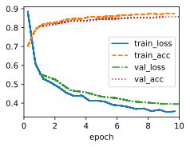
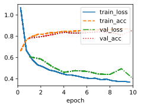
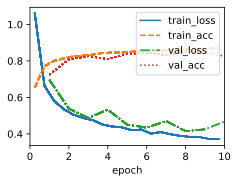
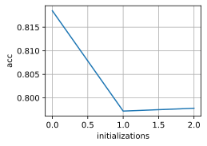

# 6. Compare the speed of the framework and the from-scratch implementation for a challenging problem. How does it change with the complexity of the network?

Comparing the speed of a deep learning framework like PyTorch with a from-scratch implementation for a challenging problem can be insightful, as it provides an understanding of the performance benefits and trade-offs of each approach. The speed comparison can be affected by various factors, including the problem complexity, network architecture, data size, and hardware resources.

Here's how the speed comparison might change with the complexity of the network:

1. **Simple Network:**
   For a relatively simple network architecture with a small number of layers and parameters, the speed difference between a framework and a from-scratch implementation might not be as significant. The overhead introduced by the framework's abstractions and optimizations could be more noticeable relative to the problem's complexity.

2. **Moderate Complexity:**
   As the network complexity increases, with more layers, units, and parameters, the deep learning framework's optimizations can become more valuable. Frameworks often leverage GPU acceleration, optimized tensor operations, and parallelism, resulting in significant speed improvements compared to a purely from-scratch implementation.

3. **Complex Network:**
   In the case of complex architectures like deep convolutional networks or large-scale recurrent networks, the gap in speed between the framework and from-scratch implementation can be substantial. The deep learning framework's low-level optimizations, automatic differentiation, and GPU acceleration can provide a significant advantage, enabling faster training and convergence.

4. **Batch Processing:**
   The deep learning framework's ability to efficiently process mini-batches of data further contributes to its speed advantage. Frameworks can take advantage of vectorized operations and parallelism to process multiple data points simultaneously, leading to faster updates of model parameters.

5. **Hardware Utilization:**
   The use of specialized hardware, such as GPUs or TPUs, can greatly accelerate training in a framework. These hardware devices are optimized for tensor operations and can significantly outperform CPUs in terms of both computation and memory bandwidth.

6. **Custom Implementation Control:**
   While a from-scratch implementation might provide more control over every aspect of the process, including initialization methods, optimization algorithms, and convergence criteria, it usually comes at the cost of development time and potentially slower execution.

In summary, deep learning frameworks like PyTorch are designed to optimize training efficiency and provide a balance between performance and flexibility. They leverage hardware acceleration, automatic differentiation, and optimizations to significantly speed up the training process, especially for complex network architectures. A from-scratch implementation, on the other hand, might offer more customization but can be significantly slower, especially for challenging problems involving complex networks.


```python
import torch.nn.init as init
import time
from tqdm import tqdm
import sys
import torch
import torchvision
from torchvision import transforms
import torch.nn as nn
import warnings
import matplotlib.pyplot as plt
import cProfile
sys.path.append('/home/jovyan/work/d2l_solutions/notebooks/exercises/d2l_utils/')
import d2l
warnings.filterwarnings("ignore")


class MulMLPScratch(d2l.Classifier):
    def __init__(self, num_inputs, num_outputs, num_hiddens, lr, sigma=0.01):
        super().__init__()
        self.save_hyperparameters()
        bef = num_inputs
        self.W = []
        self.b = []
        for num_hidden in num_hiddens:
            self.W.append(nn.Parameter(torch.randn(bef, num_hidden)*sigma))
            self.b.append(nn.Parameter(torch.zeros(num_hidden)))
            bef = num_hidden
        self.W.append(nn.Parameter(torch.randn(bef, num_outputs)*sigma))
        self.b.append(nn.Parameter(torch.zeros(num_outputs)))
        
        
    def forward(self, X):
        H = X.reshape(-1, self.num_inputs)
        for i in range(len(self.W)-1):
            H = relu(torch.matmul(H, self.W[i]) + self.b[i])
        return torch.matmul(H, self.W[-1]) + self.b[-1]
    
    def configure_optimizers(self):
        return d2l.SGD([*self.W, *self.b], self.lr)

def stat_time(model, data):
    t0 = time.time()
    trainer = d2l.Trainer(max_epochs=10, plot_flag=False)
    trainer.fit(model, data)
    return time.time() - t0

```


```python
num_hiddens=[256,128,64,32,16]
ts = []
ts_strach = []
for i in tqdm(range(1,len(num_hiddens)+1)):
    model = MulMLP(num_outputs=10, num_hiddens=num_hiddens[:i], lr=0.1)
    model_scratch = MulMLPScratch(num_inputs=784, num_outputs=10, num_hiddens=num_hiddens[:i], lr=0.1)
    ts_strach.append(stat_time(model_scratch, data))
    ts.append(stat_time(model, data))
```


```python
d2l.plot(list(range(1,len(num_hiddens)+1)),[ts,ts_strach],legend=['framework','scratch'])
```

# 7. Measure the speed of tensor–matrix multiplications for well-aligned and misaligned matrices. For instance, test for matrices with dimension 1024, 1025, 1026, 1028, and 1032.
- How does this change between GPUs and CPUs?
- Determine the memory bus width of your CPU and GPU.


# 8. Try out different activation functions. Which one works best?


```python
class ActMLP(d2l.Classifier):
    def __init__(self, num_outputs, num_hiddens, lr, act=act):
        super().__init__()
        self.save_hyperparameters()
        self.net = nn.Sequential(nn.Flatten(), nn.LazyLinear(num_hiddens),
                                 nn.ReLU(), nn.LazyLinear(num_outputs))
        
def stat_act(act, data):
    model = ActMLP(num_outputs=10, num_hiddens=256, lr=0.1, act=act)
    trainer = d2l.Trainer(max_epochs=10, plot_flag=False)
    trainer.fit(model, data)
    y_hat = model(data.val.data.type(torch.float32))
    return model.accuracy(y_hat,data.val.targets).item()
```


```python
acts = [nn.ReLU(),nn.Sigmoid(), nn.Tanh(),nn.LeakyReLU(negative_slope=0.01),nn.PReLU(num_parameters=1)]
accs = []
for act in tqdm(acts):
    accs.append(stat_act(act, data))
```


```python
d2l.plot(list(range(len(acts))),accs[-len(lrs):],'activation','acc')
```

# 9. Is there a difference between weight initializations of the network? Does it matter?


```python
class MLP(d2l.Classifier):
    def __init__(self, num_inputs,num_outputs, num_hiddens, lr):
        super().__init__()
        self.save_hyperparameters()
        self.net = nn.Sequential(nn.Flatten(), nn.Linear(num_inputs,num_hiddens),
                                 nn.ReLU(), nn.Linear(num_hiddens,num_outputs))
        

def init_xavier(module):
    if isinstance(module, nn.Linear):
        init.xavier_uniform(module.weight)
        if module.bias is not None:
            init.constant_(module.bias, 0)
            
def init_uniform(module):
    if isinstance(module, nn.LazyLinear):
        init.uniform_(module.weight)
        if module.bias is not None:
            init.constant_(module.bias, 0)
            
def init_normal(module):
    if isinstance(module, nn.LazyLinear):
        init.normal_(module.weight)
        if module.bias is not None:
            init.constant_(module.bias, 0)
            
        
def stat_init(init_f, data):
    model = MLP(num_inputs=784,num_outputs=10, num_hiddens=256, lr=0.1)
    model.apply(init_f)
    trainer = d2l.Trainer(max_epochs=10, plot_flag=True)
    trainer.fit(model, data)
    y_hat = model(data.val.data.type(torch.float32))
    return model.accuracy(y_hat,data.val.targets).item()
```


```python
data = d2l.FashionMNIST(batch_size=256)
inits = [init_xavier,init_uniform,init_normal]
accs = []
for i in tqdm(inits):
    accs.append(stat_init(i, data))
```

    100%|██████████| 3/3 [08:23<00:00, 167.90s/it]


    

    


    

    


    

    


```python
d2l.plot(list(range(len(inits))),accs[-len(inits):],'initializations','acc')
```


    

    

