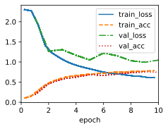
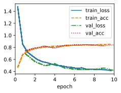
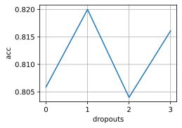
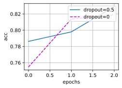
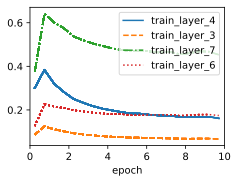
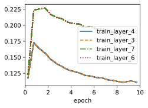
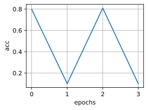
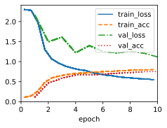
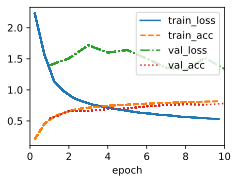

```python
import time
from tqdm import tqdm
import sys
import torch
import torchvision
from torchvision import transforms
import torch.nn as nn
import warnings
import matplotlib.pyplot as plt
import cProfile
sys.path.append('/home/jovyan/work/d2l_solutions/notebooks/exercises/d2l_utils/')
import d2l
warnings.filterwarnings("ignore")

def dropout_layer(X, dropout):
    assert 0<= dropout<= 1
    if dropout == 1:
        return torch.zeros_like(X)
    mask = (torch.randn(X.shape)>dropout).float()
    return mask * X /(1-dropout)

class DropoutMLPScratch(d2l.MulMLPScratch):
    def __init__(self, num_inputs, num_outputs, num_hiddens, lr, dropouts, sigma=0.01):
        super().__init__(num_inputs, num_outputs, num_hiddens, lr, sigma=0.01)
        self.save_hyperparameters()
        
    def forward(self, X):
        H = X.reshape(-1, self.num_inputs)
        for i in range(len(self.W)-1):
            H = d2l.relu(torch.matmul(H, self.W[i]) + self.b[i])
            if self.training:
                H = dropout_layer(H, self.dropouts[i])
                
        return torch.matmul(H, self.W[-1]) + self.b[-1]
    

class DropoutMLP(d2l.Classifier):
    def __init__(self, num_outputs, num_hiddens, lr, dropouts):
        super().__init__()
        self.save_hyperparameters()
        layers = [nn.Flatten()]
        for i in range(len(num_hiddens)):
            layers.append(nn.LazyLinear(num_hiddens[i]))
            layers.append(nn.ReLU())
            layers.append(nn.Dropout(dropouts[i]))
        layers.append(nn.LazyLinear(num_outputs))
        self.net = nn.Sequential(*layers)
    
```


```python
hparams = {'num_outputs':10, 'num_inputs':28*28, 'num_hiddens':[256]*2,
           'dropouts':[0.5]*2,'lr':0.1}
model = DropoutMLPScratch(**hparams)
data = d2l.FashionMNIST(batch_size=256)
trainer = d2l.Trainer(max_epochs=10)
trainer.fit(model, data)
y_hat = model(data.val.data.type(torch.float32)) 
print(f'acc: {model.accuracy(y_hat,data.val.targets).item():.2f}')
```

    acc: 0.66


    

    


```python
hparams = {'num_outputs':10,'num_hiddens':[256]*2,
           'dropouts':[0.5]*2,'lr':0.1}
model = DropoutMLP(**hparams)
trainer = d2l.Trainer(max_epochs=10)
trainer.fit(model, data)
y_hat = model(data.val.data.type(torch.float32)) 
print(f'acc: {model.accuracy(y_hat,data.val.targets).item():.2f}')
```

    acc: 0.78


    

    


# 1. What happens if you change the dropout probabilities for the first and second layers? In particular, what happens if you switch the ones for both layers? Design an experiment to answer these questions, describe your results quantitatively, and summarize the qualitative takeaways.


```python
def stat_dropout(dropouts):
    hparams = {'num_outputs':10,'num_hiddens':[256]*2,
           'dropouts':dropouts,'lr':0.1}
    model = DropoutMLP(**hparams)
    trainer = d2l.Trainer(max_epochs=10, plot_flag=False)
    trainer.fit(model, data)
    y_hat = model(data.val.data.type(torch.float32)) 
    return model.accuracy(y_hat,data.val.targets).item()

dropout_list = [[0.1,0.5],[0.5,0.1],[0.1,0.9],[0.9,0.1]]
accs = []
for dropouts in tqdm(dropout_list):
    accs.append(stat_dropout(dropouts))
```

    100%|██████████| 4/4 [10:39<00:00, 159.81s/it]


```python
d2l.plot(list(range(len(dropout_list))),accs[-len(dropout_list):],'dropouts','acc')
```


    

    


# 2. Increase the number of epochs and compare the results obtained when using dropout with those when not using it.


```python
def stat_epoch(dropouts,epochs):
    hparams = {'num_outputs':10,'num_hiddens':[256]*2,
           'dropouts':dropouts,'lr':0.1}
    model = DropoutMLP(**hparams)
    trainer = d2l.Trainer(max_epochs=epochs, plot_flag=False)
    trainer.fit(model, data)
    y_hat = model(data.val.data.type(torch.float32)) 
    return model.accuracy(y_hat,data.val.targets).item()

dropout_list = [[0.5,0.5],[0,0]]
epoch_list = [5,10,20]
accs = [[0]*len(epoch_list) for i in range(2)]
for i in tqdm(range(len(epoch_list))):
    for j in range(len(dropout_list)):
        accs[j][i] = stat_epoch(dropout_list[j], epoch_list[i])
```

    100%|██████████| 3/3 [18:35<00:00, 371.90s/it]


```python
d2l.plot(list(range(len(epoch_list))),[accs[0],accs[1]],'epochs','acc',legend=['dropout=0.5','dropout=0'])
```


    

    


# 3. What is the variance of the activations in each hidden layer when dropout is and is not applied? Draw a plot to show how this quantity evolves over time for both models.

The variance of the activations in each hidden layer depends on whether dropout is applied or not. Dropout is a regularization technique that randomly sets some of the activations to zero during training, which reduces the co-adaptation of features and prevents overfitting. However, dropout also introduces some noise and variance to the activations, which can affect the learning process.

When dropout is not applied, the variance of the activations in each hidden layer is simply the variance of the input data multiplied by the square of the weights. This can be derived from the formula for the variance of a linear transformation:

$$\text{Var}(Wx + b) = W^2 \text{Var}(x)$$

where $W$ is the weight matrix, $x$ is the input vector, and $b$ is the bias vector. Therefore, if we denote the activations of layer $l$ as $a^{(l)}$, we have:

$$\text{Var}(a^{(l)}) = W^{(l)2} \text{Var}(a^{(l-1)})$$

where $W^{(l)}$ is the weight matrix of layer $l$, and $a^{(0)}$ is the input data. This means that the variance of the activations can either increase or decrease depending on the magnitude of the weights.

When dropout is applied, the variance of the activations in each hidden layer is affected by the dropout rate $p$, which is the probability of keeping a neuron active. Dropout can be seen as multiplying the activations by a random binary vector $d^{(l)}$, where each element is either 0 or 1 with probability $p$. This introduces some noise and variance to the activations, which can be calculated as follows:

$$\text{Var}(d^{(l)} \odot a^{(l)}) = p(1-p)(a^{(l)})^2 + p \text{Var}(a^{(l)})$$

where $\odot$ denotes element-wise multiplication. The first term is the variance introduced by dropout, which follows a Bernoulli distribution³. The second term is the variance of the original activations, which can be computed using the formula for linear transformation as before. Therefore, we have:

$$\text{Var}(d^{(l)} \odot a^{(l)}) = p(1-p)(a^{(l)})^2 + p W^{(l)2} \text{Var}(d^{(l-1)} \odot a^{(l-1)})$$

where $d^{(0)}$ is a vector of ones. This means that the variance of the activations increases with dropout, but also depends on the dropout rate and the weights.

To summarize, dropout introduces some noise and variance to the activations in each hidden layer, which can help regularize the network and prevent overfitting. However, too much dropout can also degrade the performance and slow down the convergence. Therefore, choosing an appropriate dropout rate and weight initialization scheme is important for achieving good results.


```python
class PlotActMLP(d2l.Classifier):
    def __init__(self, num_outputs, num_hiddens, lr, dropouts):
        super().__init__()
        self.save_hyperparameters()
        layers = [nn.Flatten()]
        self.activations = []
        for i in range(len(num_hiddens)):
            layers.append(nn.LazyLinear(num_hiddens[i]))
            layers.append(nn.ReLU())
            layers.append(nn.Dropout(dropouts[i]))
            self.activations.append(i*3+4)
        layers.append(nn.LazyLinear(num_outputs))
        self.net = nn.Sequential(*layers)
        
    def training_step(self, batch, plot_flag=True):
        y_hat = self(*batch[:-1])
        # auc = torch.tensor(roc_auc_score(batch[-1].detach().numpy() , y_hat[:,1].detach().numpy()))
        if plot_flag:
            for i in self.activations:
                for j in range(2):
                    var = self.stat_activation_variance(i-j, *batch[:-1])
                    self.plot(f'layer_{i-j}',var,train=True)
            # self.plot('loss', self.loss(y_hat, batch[-1]), train=True)
            # self.plot('auc', auc, train=True)
            # self.plot('acc', self.accuracy(y_hat, batch[-1]), train=True)
        return self.loss(y_hat, batch[-1])
        
    def validation_step(self, batch, plot_flag=True):
        y_hat = self(*batch[:-1])
        # auc = torch.tensor(roc_auc_score(batch[-1].detach().numpy() , y_hat[:,1].detach().numpy()))
        # if plot_flag:
            # self.plot('loss', self.loss(y_hat, batch[-1]), train=False)
            # self.plot('auc', auc, train=True)
            # self.plot('acc', self.accuracy(y_hat, batch[-1]), train=False)
        return self.loss(y_hat, batch[-1])
    
    def stat_activation_variance(self, i, X):
        activation = self.net[:i](X)
        return ((activation-activation.mean(axis=0,keepdim=True))**2).mean()
```


```python
model.net
```


    Sequential(
      (0): Flatten(start_dim=1, end_dim=-1)
      (1): Linear(in_features=784, out_features=256, bias=True)
      (2): ReLU()
      (3): Dropout(p=0.5, inplace=False)
      (4): Linear(in_features=256, out_features=256, bias=True)
      (5): ReLU()
      (6): Dropout(p=0.5, inplace=False)
      (7): Linear(in_features=256, out_features=10, bias=True)
    )


```python
hparams = {'num_outputs':10,'num_hiddens':[256]*2,
           'dropouts':[0.5]*2,'lr':0.1}
model = PlotActMLP(**hparams)
trainer = d2l.Trainer(max_epochs=10)
trainer.fit(model, data)
```


    (98.25797310471535, 15.936136215925217)


    

    


```python
hparams = {'num_outputs':10,'num_hiddens':[256]*2,
           'dropouts':[0]*2,'lr':0.1}
model = PlotActMLP(**hparams)
trainer = d2l.Trainer(max_epochs=10)
trainer.fit(model, data)
```


    (82.04601682722569, 17.754651874303818)


    

    


# 4. Why is dropout not typically used at test time?

Dropout is a regularization technique commonly used during the training phase of a neural network to prevent overfitting. However, it's not typically used at test time for a couple of important reasons:

1. **Inference vs. Training:**
   During training, dropout works by randomly deactivating a fraction of neurons in each layer with a certain probability. This process helps prevent the network from relying too heavily on specific neurons and encourages the network to learn more robust and generalized features. During inference (test time), the goal is to make predictions on new, unseen data, and dropout doesn't serve the same purpose. Applying dropout at test time would introduce randomness into the predictions, which is undesirable.

2. **Deterministic Predictions:**
   At test time, you want the neural network to produce deterministic predictions so that you can compare and evaluate the model's performance consistently. Dropout introduces randomness into the network's activations, which leads to different predictions every time the same input is passed through the network. This makes it challenging to interpret and evaluate the model's predictions reliably.

3. **Scaling Neuron Outputs:**
   During training, dropout deactivates neurons and scales their outputs by the inverse of the dropout probability. This scaling compensates for the fact that some neurons are dropped out during each forward pass. However, during inference, this scaling is not applied, leading to different magnitudes of neuron outputs. This inconsistency can affect the model's predictions and make them less reliable.

4. **Ensemble Behavior:**
   Dropout can be viewed as training an ensemble of multiple sub-networks by randomly dropping neurons. During inference, using all the sub-networks for prediction would be computationally expensive and might not provide a clear advantage over other methods of model averaging.

5. **Alternative Techniques:**
   While dropout is effective during training, there are other techniques that achieve similar goals during inference without introducing randomness. Techniques like batch normalization and weight scaling can help stabilize the network's activations and ensure consistent and deterministic predictions.

In summary, dropout is not used at test time to maintain the deterministic and reliable nature of predictions. The main goal of dropout is to improve the generalization of the model by preventing overfitting during training. Once the model is trained, the focus shifts to making accurate and consistent predictions on new data, which dropout's randomness can hinder.

# 5. Using the model in this section as an example, compare the effects of using dropout and weight decay. What happens when dropout and weight decay are used at the same time? Are the results additive? Are there diminished returns (or worse)? Do they cancel each other out?

Dropout and weight decay are both regularization techniques that can help prevent overfitting in deep neural networks. However, they have different effects and trade-offs depending on the network architecture, the amount of training data, and the optimization algorithm.

Dropout randomly drops out units in the network during training, which reduces the co-adaptation of features and forces the network to learn more robust representations. Weight decay adds a penalty term to the loss function that shrinks the weights towards zero, which reduces the complexity and variance of the network.

When dropout and weight decay are used at the same time, they can have different interactions depending on the network and the data. Some studies have shown that combining dropout with weight decay can improve the performance and generalization of deep networks ¹². However, other studies have suggested that dropout can sometimes be incompatible with weight decay, especially when the network is not very complex or the data is not very large ³. In these cases, weight decay alone can achieve better results than dropout or dropout with weight decay.

Therefore, the effects of using dropout and weight decay are not always additive or consistent. They depend on various factors and require careful tuning and experimentation. A possible guideline is to use dropout when the network is very large and complex compared to the amount of data, and use weight decay when the network is relatively simple or the data is abundant. Alternatively, one can try different combinations of dropout and weight decay and select the best one based on validation performance.

>(1) Dropout vs weight decay - Data Science Stack Exchange. https://datascience.stackexchange.com/questions/30574/dropout-vs-weight-decay.

>(2) Fundamental Differences Between Dropout and Weight Decay in Deep Networks. https://arxiv.org/pdf/1602.04484v2.

>(3) "A comparison of dropout and weight decay for regularizing deep neural .... https://scholarworks.uark.edu/csceuht/29/.


```python
class WeightDecayDropoutMLP(DropoutMLP):
    def __init__(self, num_outputs, num_hiddens, lr, dropouts, weight_decay):
        super().__init__(num_outputs, num_hiddens, lr, dropouts)
        self.save_hyperparameters()
        
    def configure_optimizers(self):
        return torch.optim.SGD(self.parameters(), lr=self.lr, weight_decay=self.weight_decay)
    
def stat_weight_decay(dropouts, weight_decay, data):
    hparams = {'num_outputs':10,'num_hiddens':[256]*2,
           'dropouts':dropouts,'lr':0.1,'weight_decay':weight_decay}
    model = WeightDecayDropoutMLP(**hparams)
    trainer = d2l.Trainer(max_epochs=10, plot_flag=False)
    trainer.fit(model, data)
    y_hat = model(data.val.data.type(torch.float32)) 
    return model.accuracy(y_hat,data.val.targets).item()
```


```python
dropout_list = [[0]*2,[0.5]*2]
decay_list = [0,0.5]
accs = []
for dropouts in tqdm(dropout_list):
    for weight_decay in tqdm(decay_list):
        accs.append(stat_weight_decay(dropouts, weight_decay, data))
```

      0%|          | 0/2 [00:00<?, ?it/s]
      0%|          | 0/2 [00:00<?, ?it/s]
     50%|█████     | 1/2 [02:49<02:49, 169.16s/it]
    100%|██████████| 2/2 [05:31<00:00, 165.77s/it]
     50%|█████     | 1/2 [05:31<05:31, 331.55s/it]
      0%|          | 0/2 [00:00<?, ?it/s]
     50%|█████     | 1/2 [02:47<02:47, 167.28s/it]
    100%|██████████| 2/2 [05:33<00:00, 166.76s/it]
    100%|██████████| 2/2 [11:05<00:00, 332.54s/it]


```python
d2l.plot(list(range(len(accs))),accs,'epochs','acc')
```


    

    


# 6. What happens if we apply dropout to the individual weights of the weight matrix rather than the activations?

If we apply dropout to the individual weights of the weight matrix rather than the activations, we are using a technique called **dropconnect**¹. Dropconnect is a generalized version of dropout, where each weight in the network has a probability of being set to zero during training¹. This can reduce the co-adaptation of weights and make the network more robust to noise².

However, dropconnect also has some drawbacks compared to dropout. For example, dropconnect requires more memory and computation to implement, as it needs to store and update a mask matrix for each weight matrix¹. Dropconnect also introduces more sparsity and variability in the network, which can make the optimization more difficult and unstable³. Therefore, dropconnect is not as widely used as dropout in practice.


```python
class DropoutWeightMLPScratch(d2l.MulMLPScratch):
    def __init__(self, num_inputs, num_outputs, num_hiddens, lr, dropouts,
                 sigma=0.01):
        super().__init__(num_inputs, num_outputs, num_hiddens, lr, sigma=0.01)
        self.save_hyperparameters()

    def forward(self, X):
        H = X.reshape(-1, self.num_inputs)
        for i in range(len(self.W)-1):
            w = self.W[i]
            if self.training:
                w = dropout_layer(w, self.dropouts[i])
            H = d2l.relu(torch.matmul(H, w) + self.b[i])
        return torch.matmul(H, self.W[-1]) + self.b[-1]
```


```python
hparams = {'num_inputs':28*28,'num_outputs':10,'num_hiddens':[256]*2,
           'dropouts':[0.5]*2,'lr':0.1}
model = DropoutWeightMLPScratch(**hparams)
trainer = d2l.Trainer(max_epochs=10)
trainer.fit(model, data)
```


    (131.42163211107254, 44.71384280920029)


    

    


```python
y_hat = model(data.val.data.type(torch.float32)) 
print(f'acc: {model.accuracy(y_hat,data.val.targets).item():.2f}')
```

    acc: 0.67


# 7. Invent another technique for injecting random noise at each layer that is different from the standard dropout technique. Can you develop a method that outperforms dropout on the Fashion-MNIST dataset (for a fixed architecture)?

One possible technique for injecting random noise at each layer that is different from the standard dropout technique is to use a stochastic activation function. A stochastic activation function is a nonlinear function that maps the input to a random output with some probability distribution. For example, a stochastic ReLU function can be defined as:

$$f(x) = \begin{cases} x, & \text{with probability } p \\ 0, & \text{with probability } 1-p \end{cases}$$

where $p$ is a parameter that controls the level of noise. This function is similar to dropout, but instead of dropping out the neurons, it drops out the activations. This can also be seen as adding Bernoulli noise to the activations.

A stochastic activation function can introduce some randomness and diversity to the network, which can help prevent overfitting and improve generalization. However, unlike dropout, a stochastic activation function does not need to scale the activations during inference, since the expected value of the function is equal to the input. This can simplify the implementation and reduce the computational cost.


```python
class StochasticReLU(nn.Module):
    def __init__(self, p=0.5):
        super().__init__()
        self.p = p # probability of keeping a neuron active
        self.mask = None # binary mask for dropout
    
    def forward(self, x):
        if self.training: # apply dropout during training
            self.mask = torch.bernoulli(torch.full(x.shape, self.p)) # sample a mask from Bernoulli distribution
            x = x * self.mask # element-wise multiplication
        return torch.relu(x) # apply ReLU activation
    

class StochasticReLUMLP(d2l.Classifier):
    def __init__(self, num_outputs, num_hiddens, lr, dropouts):
        super().__init__()
        self.save_hyperparameters()
        layers = [nn.Flatten()]
        for i in range(len(num_hiddens)):
            layers.append(nn.LazyLinear(num_hiddens[i]))
            # layers.append(nn.ReLU())
            layers.append(StochasticReLU(dropouts[i]))
        layers.append(nn.LazyLinear(num_outputs))
        self.net = nn.Sequential(*layers)
    
```


```python
hparams = {'num_outputs':10,'num_hiddens':[256]*2,
           'dropouts':[0.5]*2,'lr':0.1}
model = StochasticReLUMLP(**hparams)
trainer = d2l.Trainer(max_epochs=10)
trainer.fit(model, data)
y_hat = model(data.val.data.type(torch.float32)) 
print(f'acc: {model.accuracy(y_hat,data.val.targets).item():.2f}')
```

    acc: 0.71


    

    

