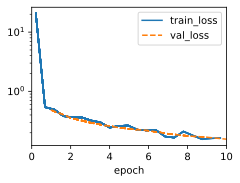
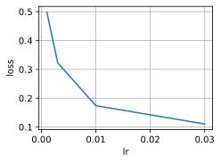
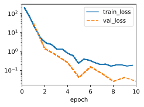
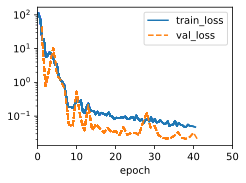
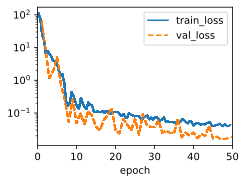
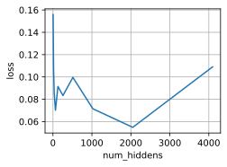
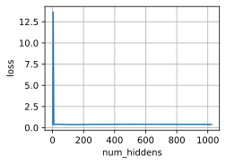
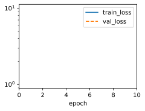

```python
import pandas as pd
import time
from tqdm import tqdm
import sys
import torch
import torchvision
from torchvision import transforms
import torch.nn as nn
import warnings
import matplotlib.pyplot as plt
import cProfile
sys.path.append('/home/jovyan/work/d2l_solutions/notebooks/exercises/d2l_utils/')
import d2l
warnings.filterwarnings("ignore")

class KaggleHouse(d2l.DataModule):
    def __init__(self, batch_size, train=None, val=None):
        super().__init__()
        self.save_hyperparameters()
        if self.train is None:
            self.raw_train = pd.read_csv(d2l.download(d2l.DATA_URL+ 'kaggle_house_pred_train.csv', self.root,
                sha1_hash='585e9cc93e70b39160e7921475f9bcd7d31219ce'))
            self.raw_val = pd.read_csv(d2l.download(
                d2l.DATA_URL + 'kaggle_house_pred_test.csv', self.root,
                sha1_hash='fa19780a7b011d9b009e8bff8e99922a8ee2eb90'))
            
    def preprocess(self, std_flag=True):
        label = 'SalePrice'
        features = pd.concat((self.raw_train.drop(columns=['Id',label]),
                              self.raw_val.drop(columns=['Id'])))
        numeric_features = features.dtypes[features.dtypes!='object'].index
        if std_flag:
            features[numeric_features] = features[numeric_features].apply(lambda x: (x-x.mean())/x.std())
        features[numeric_features] = features[numeric_features].fillna(0)
        features = pd.get_dummies(features, dummy_na=True)
        self.train = features[:self.raw_train.shape[0]].copy()
        self.train[label] = self.raw_train[label]
        self.val = features[self.raw_train.shape[0]:].copy()
        
    def get_dataloader(self, train):
        label = 'SalePrice'
        data = self.train if train else self.val
        if label not in data:
            return
        get_tensor = lambda x: torch.tensor(x.values.astype(float), dtype=torch.float32)
        # tensors = (get_tensor(data.drop(columns=[label])),
        #            torch.log(get_tensor(data[label])).reshape(-1,1))
        tensors = (get_tensor(data.drop(columns=[label])),  # X
               torch.log(get_tensor(data[label])).reshape((-1, 1)))  # Y
        return self.get_tensorloader(tensors, train)
    
def k_fold_data(data,k):
    rets = []
    fold_size = data.train.shape[0] // k
    for j in range(k):
        idx = range(j*fold_size,(j+1)*fold_size)
        rets.append(KaggleHouse(data.batch_size,data.train.drop(index=idx),data.train.iloc[idx]))
    return rets

def k_fold(trainer, data, k, ModelClass,hparams,plot_flag=True):
    val_loss, models = [], []
    for i, data_fold in enumerate(k_fold_data(data,k)):
        model = ModelClass(**hparams)
        model.board.yscale='log'
        if not plot_flag or i != 0:
            model.board.display=False
        trainer.fit(model,data_fold)
        val_loss.append(float(model.board.data['val_loss'][-1].y))
        models.append(model)
    avg_val_loss = sum(val_loss)/len(val_loss)
    print(f'average validation log mse = {avg_val_loss}, params:{hparams}')
    return models, avg_val_loss
```


```python
data = KaggleHouse(batch_size=64)
print(data.raw_train.shape)
print(data.raw_val.shape)
data.preprocess()
print(data.train.shape)
print(data.val.shape)
```

    (1460, 81)
    (1459, 80)
    (1460, 332)
    (1459, 331)


```python
trainer = d2l.Trainer(max_epochs=10)
models,avg_val_loss = k_fold(trainer, data, k=5,ModelClass=d2l.LinearRegression,hparams={'lr':0.01})
```

    average validation log mse = 0.1812428626418114


    

    


```python
preds = [model(torch.tensor(data.val.values.astype(float), dtype=torch.float32)) for model in models]
ensemble_preds = torch.exp(torch.cat(preds,1)).mean(1)
submission = pd.DataFrame({'Id':data.raw_val.Id,'SalePrice':ensemble_preds.detach().numpy()})
submission.to_csv('submission.csv', index=False)
```

# 2. Is it always a good idea to replace missing values by a mean? Hint: can you construct a situation where the values are not missing at random?


Replacing missing values with the mean is a common approach for handling missing data, but it's not always a good idea. One important consideration is whether the missing values are missing completely at random (MCAR), missing at random (MAR), or missing not at random (MNAR). Let's explore a situation where the values are not missing at random and discuss why replacing missing values with the mean might not be appropriate:

**Situation:**
Imagine you're collecting data on income and education level for a survey, but some respondents choose not to disclose their income if it's above a certain threshold. This introduces a systematic pattern of missing data based on income.

**Explanation:**
In this situation, the missing data mechanism is not random. The probability of missing data depends on the value itself (income), making it missing not at random (MNAR). People with higher incomes are more likely to withhold their income information, which introduces bias in the data.

**Implications:**
Replacing the missing values with the mean could introduce significant bias in the dataset. If you fill in missing income values with the mean income, you'll underestimate the actual income distribution and potentially mislead any analysis or modeling you perform.

**Alternative Approaches:**
In cases where data is MNAR, simply imputing missing values with the mean or other measures can lead to biased and inaccurate results. Some alternative approaches include:
- Using advanced imputation methods that consider relationships between variables.
- Creating a separate category or indicator variable to capture the fact that data is missing.
- Applying domain-specific knowledge to impute missing values.

When dealing with missing data, it's crucial to understand the underlying mechanisms causing the missingness and to choose an appropriate imputation strategy that minimizes bias and maintains the integrity of the data.

# 3. Improve the score by tuning the hyperparameters through K-fold cross-validation.


```python
lr_list = [0.001,0.003,0.01,0.03,0.05,0.08,0.1]
loss_list = []
for lr in tqdm(lr_list):
    trainer = d2l.Trainer(max_epochs=10)
    models, val_loss = k_fold(trainer, data, k=5,ModelClass=d2l.LinearRegression,hparams={'lr':lr},plot_flag=False)
    loss_list.append(val_loss)
d2l.plot(lr_list,loss_list,'lr','loss')
```

     14%|█▍        | 1/7 [00:01<00:11,  1.99s/it]

    average validation log mse = 0.49889659166336064


     29%|██▊       | 2/7 [00:04<00:10,  2.15s/it]

    average validation log mse = 0.3225225901603698


     43%|████▎     | 3/7 [00:06<00:08,  2.06s/it]

    average validation log mse = 0.17420742630958558


     57%|█████▋    | 4/7 [00:08<00:06,  2.01s/it]

    average validation log mse = 0.11064194679260253


     71%|███████▏  | 5/7 [00:10<00:03,  1.99s/it]

    average validation log mse = nan


     86%|████████▌ | 6/7 [00:12<00:01,  1.97s/it]

    average validation log mse = nan


    100%|██████████| 7/7 [00:13<00:00,  1.99s/it]

    average validation log mse = nan


    


    

    


# 4. Improve the score by improving the model (e.g., layers, weight decay, and dropout).


```python
class HouseMLP(d2l.LinearRegression):
    def __init__(self, num_outputs, num_hiddens, lr, dropouts, weight_decay):
        super().__init__(lr)
        self.save_hyperparameters()
        layers = [nn.Flatten()]
        for i in range(len(num_hiddens)):
            layers.append(nn.LazyLinear(num_hiddens[i]))
            layers.append(nn.ReLU())
            layers.append(nn.Dropout(dropouts[i]))
        layers.append(nn.LazyLinear(num_outputs))
        self.net = nn.Sequential(*layers)
        
    def configure_optimizers(self):
        return torch.optim.SGD(self.parameters(), lr=self.lr, weight_decay=self.weight_decay)
```


```python
hparams = {'dropouts': [0.1],
 'lr': 0.03,
 'num_hiddens': [128],
 'num_outputs': 1,
 'weight_decay': 0}
trainer = d2l.Trainer(max_epochs=10)
models,avg_val_loss = k_fold(trainer, data, k=5,ModelClass=HouseMLP,hparams=hparams,plot_flag=True)
```

    average validation log mse = 0.06317381292581557


    

    


```python
hparams = {'dropouts': [0.1,0],
 'lr': 0.01,
 'num_hiddens': [128,64],
 'num_outputs': 1,
 'weight_decay': 0}
trainer = d2l.Trainer(max_epochs=50)
models,avg_val_loss = k_fold(trainer, data, k=5,ModelClass=HouseMLP,hparams=hparams,plot_flag=True)
```


    

    


```python
from sklearn.model_selection import ParameterGrid
# hiddens = [[i] for i in d2l.gen_logrithm_nums(initial_value = 2, growth_factor = 2, num_elements = 12)]
param_grid = {
    'num_outputs' : [1],
    'num_hiddens': [[128,64],[256,128]],
    'dropouts':[[0,0],[0,0.1],[0.1,0]],
    'lr': [0.01],
    'weight_decay':[0]
}
loss_list = []
min_val_loss = sys.maxsize
best_hparams = None
for hparams in ParameterGrid(param_grid):
    trainer = d2l.Trainer(max_epochs=50)
    models,avg_val_loss = k_fold(trainer, data, k=5,ModelClass=HouseMLP,hparams=hparams,plot_flag=True)
    if avg_val_loss < min_val_loss:
        min_val_loss = avg_val_loss
        best_hparams = hparams
    loss_list.append(avg_val_loss)
d2l.plot(list(range(len(loss_list))),loss_list,'num_hiddens','loss')
best_hparams
```


    

    


```python
from sklearn.model_selection import ParameterGrid
hiddens = [[i] for i in d2l.gen_logrithm_nums(initial_value = 2, growth_factor = 2, num_elements = 12)]
param_grid = {
    'num_outputs' : [1],
    'num_hiddens': hiddens,
    'dropouts':[[0],[0.1],[0.5],[0.9]],
    'lr': [0.03],
    'weight_decay':[0]
}
loss_list = []
min_val_loss = sys.maxsize
best_hparams = None
for hparams in ParameterGrid(param_grid):
    trainer = d2l.Trainer(max_epochs=10)
    models,avg_val_loss = k_fold(trainer, data, k=5,ModelClass=HouseMLP,hparams=hparams,plot_flag=False)
    if avg_val_loss < min_val_loss:
        min_val_loss = avg_val_loss
        best_hparams = hparams
    loss_list.append(avg_val_loss)
d2l.plot(list(range(len(loss_list))),loss_list,'num_hiddens','loss')
best_hparams
```

    average validation log mse = 0.15597612142562864
    average validation log mse = 0.13577107995748522
    average validation log mse = 0.15525818824768067
    average validation log mse = 0.08841185145080088
    average validation log mse = 0.05512222554534674
    average validation log mse = 0.051144136339426036
    average validation log mse = 0.05264632806181907
    average validation log mse = 0.09473576806485652
    average validation log mse = 0.14789447471499445
    average validation log mse = 0.07303549513220786
    average validation log mse = 0.12492370799183845
    average validation log mse = 0.094398273229599
    average validation log mse = 0.15588923692703247
    average validation log mse = 0.1559228077530861
    average validation log mse = 0.13547121971845627
    average validation log mse = 0.11138698883354663
    average validation log mse = 0.09907439850270747
    average validation log mse = 0.0773102281242609
    average validation log mse = 0.042829845622181895
    average validation log mse = 0.06431130655109882
    average validation log mse = 0.09413490794599055
    average validation log mse = 0.09793753564357757
    average validation log mse = 0.10575070142745972
    average validation log mse = 0.2000359669327736
    average validation log mse = 0.1404000963270664
    average validation log mse = nan
    average validation log mse = 0.13427209094166756
    average validation log mse = 0.10552772894501687
    average validation log mse = 0.11635939359664918
    average validation log mse = 0.06258775025606156
    average validation log mse = 0.07950101301074028
    average validation log mse = 0.05825570095330477
    average validation log mse = 0.22776039578020574
    average validation log mse = 0.06070375956594944
    average validation log mse = 0.2359133403748274
    average validation log mse = nan
    average validation log mse = 0.1570881086587906
    average validation log mse = 0.15614743083715438
    average validation log mse = nan
    average validation log mse = nan
    average validation log mse = nan
    average validation log mse = nan
    average validation log mse = nan
    average validation log mse = nan
    average validation log mse = nan
    average validation log mse = nan
    average validation log mse = nan
    average validation log mse = nan


    {'dropouts': [0.1],
     'lr': 0.03,
     'num_hiddens': [128],
     'num_outputs': 1,
     'weight_decay': 0}


    

    


```python
hiddens = d2l.gen_logrithm_nums(initial_value = 2, growth_factor = 2, num_elements = 12)
loss_list = []
for hidden in tqdm(hiddens):
    hparams = {'num_outputs':1,'num_hiddens':[hidden],
               'dropouts':[0],'lr':0.03,'weight_decay':0}
    trainer = d2l.Trainer(max_epochs=10)
    models,avg_val_loss = k_fold(trainer, data, k=5,ModelClass=HouseMLP,hparams=hparams,plot_flag=False)
    loss_list.append(avg_val_loss)
d2l.plot(hiddens,loss_list,'num_hiddens','loss')
```

      8%|▊         | 1/12 [00:02<00:23,  2.12s/it]

    average validation log mse = 0.1559700670838356


     17%|█▋        | 2/12 [00:04<00:21,  2.11s/it]

    average validation log mse = 0.15578327625989913


     25%|██▌       | 3/12 [00:06<00:19,  2.13s/it]

    average validation log mse = 0.13895011991262435


     33%|███▎      | 4/12 [00:08<00:18,  2.30s/it]

    average validation log mse = 0.10713853552937506


     42%|████▏     | 5/12 [00:11<00:17,  2.49s/it]

    average validation log mse = 0.08525513358414173


     50%|█████     | 6/12 [00:15<00:17,  2.90s/it]

    average validation log mse = 0.07017345719039439


     58%|█████▊    | 7/12 [00:18<00:14,  2.84s/it]

    average validation log mse = 0.09145292930305003


     67%|██████▋   | 8/12 [00:21<00:11,  2.99s/it]

    average validation log mse = 0.08335102312266826


     75%|███████▌  | 9/12 [00:24<00:09,  3.03s/it]

    average validation log mse = 0.09956287808716298


     83%|████████▎ | 10/12 [00:28<00:06,  3.42s/it]

    average validation log mse = 0.07146885335445405


     92%|█████████▏| 11/12 [00:33<00:03,  3.91s/it]

    average validation log mse = 0.05483937889337539


    100%|██████████| 12/12 [00:41<00:00,  3.48s/it]

    average validation log mse = 0.10901849515736103


    


    

    


```python
loss_list = []
dropouts = [0,0.1,0.5,0.9]
for dropout in tqdm(dropouts):
    hparams = {'num_outputs':1,'num_hiddens':[2048],
               'dropouts':[dropout],'lr':0.03,'weight_decay':0}
    trainer = d2l.Trainer(max_epochs=10)
    models,avg_val_loss = k_fold(trainer, data, k=5,ModelClass=HouseMLP,hparams=hparams,plot_flag=False)
    loss_list.append(avg_val_loss)
d2l.plot(dropouts,loss_list,'dropouts','loss')
```

     25%|██▌       | 1/4 [00:05<00:17,  5.80s/it]

    average validation log mse = 0.09637121334671975


     50%|█████     | 2/4 [00:12<00:12,  6.16s/it]

    average validation log mse = 0.08548261269927025


     75%|███████▌  | 3/4 [00:19<00:06,  6.70s/it]

    average validation log mse = 0.10088834322988986


    100%|██████████| 4/4 [00:25<00:00,  6.46s/it]

    average validation log mse = nan


    


    

    


```python
hparams = {'num_outputs':1,'num_hiddens':[2048,1024],
               'dropouts':[0]*2,'lr':0.001,'weight_decay':0}
trainer = d2l.Trainer(max_epochs=50)
models,avg_val_loss = k_fold(trainer, data, k=5,ModelClass=HouseMLP,hparams=hparams)
```

    average validation log mse = nan


    

    


```python
hiddens = d2l.gen_logrithm_nums(initial_value = 2, growth_factor = 2, num_elements = 10)
loss_list = []
for hidden in tqdm(hiddens):
    hparams = {'num_outputs':1,'num_hiddens':[2048,hidden],
               'dropouts':[0]*2,'lr':0.001,'weight_decay':0}
    trainer = d2l.Trainer(max_epochs=10)
    models,avg_val_loss = k_fold(trainer, data, k=5,ModelClass=HouseMLP,hparams=hparams,plot_flag=False)
    loss_list.append(avg_val_loss)
d2l.plot(hiddens,loss_list,'num_hiddens','loss')
```

     10%|█         | 1/10 [00:05<00:45,  5.07s/it]

    average validation log mse = 0.38017837405204774


     20%|██        | 2/10 [00:12<00:52,  6.54s/it]

    average validation log mse = 13.644279939532279


     30%|███       | 3/10 [00:17<00:41,  5.95s/it]

    average validation log mse = 0.3754747492074967


     40%|████      | 4/10 [00:23<00:33,  5.63s/it]

    average validation log mse = 0.3778238511085511


     50%|█████     | 5/10 [00:28<00:27,  5.50s/it]

    average validation log mse = 0.40622438788414


     60%|██████    | 6/10 [00:33<00:22,  5.52s/it]

    average validation log mse = 0.38827632665634154


     70%|███████   | 7/10 [00:40<00:17,  5.83s/it]

    average validation log mse = 0.36584885001182554


     80%|████████  | 8/10 [00:48<00:13,  6.60s/it]

    average validation log mse = 0.3892289334535599


     90%|█████████ | 9/10 [01:03<00:09,  9.19s/it]

    average validation log mse = 0.40631776690483096


    100%|██████████| 10/10 [01:18<00:00,  7.87s/it]

    average validation log mse = 0.39205386698246003


    


    

    


```python
from sklearn.model_selection import ParameterGrid

# Define hyperparameter grid
param_grid = {
    'learning_rate': [0.001, 0.01, 0.1],
    'num_hidden_units': [64, 128, 256],
    # ... other hyperparameters ...
}
for params in ParameterGrid(param_grid):
    print(params)
```

    {'learning_rate': 0.001, 'num_hidden_units': 64}
    {'learning_rate': 0.001, 'num_hidden_units': 128}
    {'learning_rate': 0.001, 'num_hidden_units': 256}
    {'learning_rate': 0.01, 'num_hidden_units': 64}
    {'learning_rate': 0.01, 'num_hidden_units': 128}
    {'learning_rate': 0.01, 'num_hidden_units': 256}
    {'learning_rate': 0.1, 'num_hidden_units': 64}
    {'learning_rate': 0.1, 'num_hidden_units': 128}
    {'learning_rate': 0.1, 'num_hidden_units': 256}


# 5. What happens if we do not standardize the continuous numerical features as we have done in this section?

If you do not standardize the continuous numerical features before training a machine learning model, it can lead to several issues that may affect the performance and convergence of the model. Standardization (also known as feature scaling) involves transforming the features to have zero mean and unit variance. Here are some consequences of not standardizing the features:

1. **Feature Magnitudes Impact:** Machine learning algorithms, especially those based on distance metrics (e.g., k-nearest neighbors, support vector machines), are sensitive to the scale of features. Features with larger magnitudes can dominate those with smaller magnitudes, leading to biased or suboptimal results.

2. **Slow Convergence:** Gradient-based optimization algorithms (e.g., gradient descent) may converge slowly or fail to converge if features have different scales. This is because the optimization process takes longer to find optimal weights for each feature.

3. **Model Interpretability:** Coefficients or weights assigned to features become less interpretable when features are not standardized. It becomes difficult to compare the importance of different features in the model.

4. **Regularization Effects:** Some regularization techniques assume that features are on a similar scale. Without standardization, regularization terms may not work as intended and penalize features with larger magnitudes more than necessary.

5. **Incorrect Feature Importance:** Feature importance measures may be skewed if features have different scales. Features with larger scales may appear more important even if they aren't.

6. **Inaccurate Distance Metrics:** Algorithms relying on distance metrics may perform poorly, as distances between instances are affected by feature scales.

7. **Inconsistent Comparisons:** Comparing two instances or data points becomes challenging when their features are on different scales.

8. **Sensitivity to Outliers:** Features with larger scales are more sensitive to outliers, potentially leading to biased models.

To address these issues, it's generally recommended to standardize continuous numerical features before feeding them into a machine learning model. Common methods for standardization include z-score normalization (subtracting the mean and dividing by the standard deviation) or Min-Max scaling (scaling features to a specific range, e.g., [0, 1]). Standardization ensures that each feature contributes equally to the model's learning process and helps the model achieve better convergence and generalization on unseen data.


```python
data = KaggleHouse(batch_size=64)
data.preprocess(std_flag=False)
trainer = d2l.Trainer(max_epochs=10)
models,avg_val_loss = k_fold(trainer, data, k=5,ModelClass=d2l.LinearRegression,hparams={'lr':0.01})
```

    average validation log mse = nan


    

    

