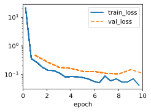

```python
import torch
import torch.nn as nn
from torch.nn import functional as F
import sys
sys.path.append('/home/jovyan/work/d2l_solutions/notebooks/exercises/d2l_utils/')
import d2l
from torchsummary import summary


def conv_block(num_channels):
    return nn.Sequential(
        nn.LazyBatchNorm2d(), nn.ReLU(),
        nn.LazyConv2d(num_channels, kernel_size=3, padding=1))

def transition_block(num_channels):
    return nn.Sequential(
        nn.LazyBatchNorm2d(), nn.ReLU(),
        nn.LazyConv2d(num_channels, kernel_size=1),
        nn.AvgPool2d(kernel_size=2, stride=2))

class DenseBlock(nn.Module):
    def __init__(self, num_convs, num_channels):
        super(DenseBlock, self).__init__()
        layer = []
        for i in range(num_convs):
            layer.append(conv_block(num_channels))
        self.net = nn.Sequential(*layer)

    def forward(self, X):
        for blk in self.net:
            Y = blk(X)
            # Concatenate input and output of each block along the channels
            X = torch.cat((X, Y), dim=1)
        return X
    
class DenseNet(d2l.Classifier):
    def b1(self):
        return nn.Sequential(
            nn.LazyConv2d(64, kernel_size=7, stride=2, padding=3),
            nn.LazyBatchNorm2d(), nn.ReLU(),
            nn.MaxPool2d(kernel_size=3, stride=2, padding=1))
    
    def __init__(self, num_channels=64, growth_rate=32, arch=(4, 4, 4, 4),
                 lr=0.1, num_classes=10):
        super(DenseNet, self).__init__()
        self.save_hyperparameters()
        self.net = nn.Sequential(self.b1())
        for i, num_convs in enumerate(arch):
            self.net.add_module(f'dense_blk{i+1}', DenseBlock(num_convs,
                                                              growth_rate))
            # The number of output channels in the previous dense block
            num_channels += num_convs * growth_rate
            # A transition layer that halves the number of channels is added
            # between the dense blocks
            if i != len(arch) - 1:
                num_channels //= 2
                self.net.add_module(f'tran_blk{i+1}', transition_block(
                    num_channels))
        self.net.add_module('last', nn.Sequential(
            nn.LazyBatchNorm2d(), nn.ReLU(),
            nn.AdaptiveAvgPool2d((1, 1)), nn.Flatten(),
            nn.LazyLinear(num_classes)))
        self.net.apply(d2l.init_cnn)
```

# 1. Why do we use average pooling rather than max-pooling in the transition layer?

In DenseNet architectures, transition layers are used to reduce the spatial dimensions (width and height) of feature maps while also reducing the number of feature maps (channels) before passing them to the next dense block. The choice between average pooling and max-pooling in transition layers depends on the design goals and the desired properties of the network. In DenseNet, average pooling is often preferred over max-pooling for several reasons:

1. **Feature Retention**: Average pooling computes the average value of the elements in a pooling region. This retains more information about the features compared to max-pooling, which only selects the maximum value. In DenseNet, where information from all previous layers is concatenated together, average pooling helps in maintaining a more comprehensive representation of the features.

2. **Smoothing Effect**: Average pooling has a smoothing effect on the output feature maps. This can help in reducing the risk of overfitting by preventing the network from becoming too sensitive to specific details in the data.

3. **Stability**: Average pooling is less sensitive to outliers compared to max-pooling. This can make the network more robust to noise or variations in the input data.

4. **Translation Invariance**: Average pooling provides a certain degree of translation invariance by taking into account the overall distribution of values in the pooling region. This can be beneficial in scenarios where small translations of the input should not significantly affect the output.

5. **Information Sharing**: Average pooling promotes information sharing among neighboring pixels or units. This can help in capturing global patterns and structures present in the input data.

While average pooling is preferred in transition layers, max-pooling can still have its own advantages in certain contexts. For example, in architectures like convolutional neural networks (CNNs) that prioritize capturing local features and enhancing feature maps, max-pooling can be effective. However, in DenseNet's context, where the emphasis is on maintaining rich information flow and reducing the risk of information loss, average pooling aligns better with the architecture's principles.

Ultimately, the choice between average pooling and max-pooling depends on the specific goals of the network, the characteristics of the data, and the overall design philosophy.

# 2. One of the advantages mentioned in the DenseNet paper is that its model parameters are smaller than those of ResNet. Why is this the case?


```python
def count_parameters(model):
    return sum(p.numel() for p in model.parameters())

data = d2l.FashionMNIST(batch_size=32, resize=(224, 224))
arch18 = [(2,[(64,3,1)]*2,None),(2,[(128,3,1)]*2,128),(2,[(256,3,1)]*2,256),(2,[(512,3,1)]*2,512)]
resnet18 = d2l.ResNet(arch=arch18, lr=0.01)
resnet18.apply_init([next(iter(data.get_dataloader(True)))[0]], d2l.init_cnn)
print(count_parameters(resnet18))
summary(resnet18, (1, 224, 224))
```

    11523338
    ----------------------------------------------------------------
            Layer (type)               Output Shape         Param #
    ================================================================
                Conv2d-1         [-1, 64, 112, 112]           3,200
           BatchNorm2d-2         [-1, 64, 112, 112]             128
                  ReLU-3         [-1, 64, 112, 112]               0
             MaxPool2d-4           [-1, 64, 56, 56]               0
                Conv2d-5           [-1, 64, 56, 56]          36,928
           BatchNorm2d-6           [-1, 64, 56, 56]             128
                  ReLU-7           [-1, 64, 56, 56]               0
                Conv2d-8           [-1, 64, 56, 56]          36,928
           BatchNorm2d-9           [-1, 64, 56, 56]             128
             Residual-10           [-1, 64, 56, 56]               0
               Conv2d-11           [-1, 64, 56, 56]          36,928
          BatchNorm2d-12           [-1, 64, 56, 56]             128
                 ReLU-13           [-1, 64, 56, 56]               0
               Conv2d-14           [-1, 64, 56, 56]          36,928
          BatchNorm2d-15           [-1, 64, 56, 56]             128
             Residual-16           [-1, 64, 56, 56]               0
               Conv2d-17          [-1, 128, 28, 28]          73,856
          BatchNorm2d-18          [-1, 128, 28, 28]             256
                 ReLU-19          [-1, 128, 28, 28]               0
               Conv2d-20          [-1, 128, 28, 28]         147,584
          BatchNorm2d-21          [-1, 128, 28, 28]             256
               Conv2d-22          [-1, 128, 28, 28]           8,320
             Residual-23          [-1, 128, 28, 28]               0
               Conv2d-24          [-1, 128, 28, 28]         147,584
          BatchNorm2d-25          [-1, 128, 28, 28]             256
                 ReLU-26          [-1, 128, 28, 28]               0
               Conv2d-27          [-1, 128, 28, 28]         147,584
          BatchNorm2d-28          [-1, 128, 28, 28]             256
               Conv2d-29          [-1, 128, 28, 28]          16,512
             Residual-30          [-1, 128, 28, 28]               0
               Conv2d-31          [-1, 256, 14, 14]         295,168
          BatchNorm2d-32          [-1, 256, 14, 14]             512
                 ReLU-33          [-1, 256, 14, 14]               0
               Conv2d-34          [-1, 256, 14, 14]         590,080
          BatchNorm2d-35          [-1, 256, 14, 14]             512
               Conv2d-36          [-1, 256, 14, 14]          33,024
             Residual-37          [-1, 256, 14, 14]               0
               Conv2d-38          [-1, 256, 14, 14]         590,080
          BatchNorm2d-39          [-1, 256, 14, 14]             512
                 ReLU-40          [-1, 256, 14, 14]               0
               Conv2d-41          [-1, 256, 14, 14]         590,080
          BatchNorm2d-42          [-1, 256, 14, 14]             512
               Conv2d-43          [-1, 256, 14, 14]          65,792
             Residual-44          [-1, 256, 14, 14]               0
               Conv2d-45            [-1, 512, 7, 7]       1,180,160
          BatchNorm2d-46            [-1, 512, 7, 7]           1,024
                 ReLU-47            [-1, 512, 7, 7]               0
               Conv2d-48            [-1, 512, 7, 7]       2,359,808
          BatchNorm2d-49            [-1, 512, 7, 7]           1,024
               Conv2d-50            [-1, 512, 7, 7]         131,584
             Residual-51            [-1, 512, 7, 7]               0
               Conv2d-52            [-1, 512, 7, 7]       2,359,808
          BatchNorm2d-53            [-1, 512, 7, 7]           1,024
                 ReLU-54            [-1, 512, 7, 7]               0
               Conv2d-55            [-1, 512, 7, 7]       2,359,808
          BatchNorm2d-56            [-1, 512, 7, 7]           1,024
               Conv2d-57            [-1, 512, 7, 7]         262,656
             Residual-58            [-1, 512, 7, 7]               0
    AdaptiveAvgPool2d-59            [-1, 512, 1, 1]               0
              Flatten-60                  [-1, 512]               0
               Linear-61                   [-1, 10]           5,130
    ================================================================
    Total params: 11,523,338
    Trainable params: 11,523,338
    Non-trainable params: 0
    ----------------------------------------------------------------
    Input size (MB): 0.19
    Forward/backward pass size (MB): 57.05
    Params size (MB): 43.96
    Estimated Total Size (MB): 101.20
    ----------------------------------------------------------------


```python
model = DenseNet(lr=0.01)
model.apply_init([next(iter(data.get_dataloader(True)))[0]], d2l.init_cnn)
print(count_parameters(model))
summary(model, (1, 224, 224))
```

    758226
    ----------------------------------------------------------------
            Layer (type)               Output Shape         Param #
    ================================================================
                Conv2d-1         [-1, 64, 112, 112]           3,200
           BatchNorm2d-2         [-1, 64, 112, 112]             128
                  ReLU-3         [-1, 64, 112, 112]               0
             MaxPool2d-4           [-1, 64, 56, 56]               0
           BatchNorm2d-5           [-1, 64, 56, 56]             128
                  ReLU-6           [-1, 64, 56, 56]               0
                Conv2d-7           [-1, 32, 56, 56]          18,464
           BatchNorm2d-8           [-1, 96, 56, 56]             192
                  ReLU-9           [-1, 96, 56, 56]               0
               Conv2d-10           [-1, 32, 56, 56]          27,680
          BatchNorm2d-11          [-1, 128, 56, 56]             256
                 ReLU-12          [-1, 128, 56, 56]               0
               Conv2d-13           [-1, 32, 56, 56]          36,896
          BatchNorm2d-14          [-1, 160, 56, 56]             320
                 ReLU-15          [-1, 160, 56, 56]               0
               Conv2d-16           [-1, 32, 56, 56]          46,112
           DenseBlock-17          [-1, 192, 56, 56]               0
          BatchNorm2d-18          [-1, 192, 56, 56]             384
                 ReLU-19          [-1, 192, 56, 56]               0
               Conv2d-20           [-1, 96, 56, 56]          18,528
            AvgPool2d-21           [-1, 96, 28, 28]               0
          BatchNorm2d-22           [-1, 96, 28, 28]             192
                 ReLU-23           [-1, 96, 28, 28]               0
               Conv2d-24           [-1, 32, 28, 28]          27,680
          BatchNorm2d-25          [-1, 128, 28, 28]             256
                 ReLU-26          [-1, 128, 28, 28]               0
               Conv2d-27           [-1, 32, 28, 28]          36,896
          BatchNorm2d-28          [-1, 160, 28, 28]             320
                 ReLU-29          [-1, 160, 28, 28]               0
               Conv2d-30           [-1, 32, 28, 28]          46,112
          BatchNorm2d-31          [-1, 192, 28, 28]             384
                 ReLU-32          [-1, 192, 28, 28]               0
               Conv2d-33           [-1, 32, 28, 28]          55,328
           DenseBlock-34          [-1, 224, 28, 28]               0
          BatchNorm2d-35          [-1, 224, 28, 28]             448
                 ReLU-36          [-1, 224, 28, 28]               0
               Conv2d-37          [-1, 112, 28, 28]          25,200
            AvgPool2d-38          [-1, 112, 14, 14]               0
          BatchNorm2d-39          [-1, 112, 14, 14]             224
                 ReLU-40          [-1, 112, 14, 14]               0
               Conv2d-41           [-1, 32, 14, 14]          32,288
          BatchNorm2d-42          [-1, 144, 14, 14]             288
                 ReLU-43          [-1, 144, 14, 14]               0
               Conv2d-44           [-1, 32, 14, 14]          41,504
          BatchNorm2d-45          [-1, 176, 14, 14]             352
                 ReLU-46          [-1, 176, 14, 14]               0
               Conv2d-47           [-1, 32, 14, 14]          50,720
          BatchNorm2d-48          [-1, 208, 14, 14]             416
                 ReLU-49          [-1, 208, 14, 14]               0
               Conv2d-50           [-1, 32, 14, 14]          59,936
           DenseBlock-51          [-1, 240, 14, 14]               0
          BatchNorm2d-52          [-1, 240, 14, 14]             480
                 ReLU-53          [-1, 240, 14, 14]               0
               Conv2d-54          [-1, 120, 14, 14]          28,920
            AvgPool2d-55            [-1, 120, 7, 7]               0
          BatchNorm2d-56            [-1, 120, 7, 7]             240
                 ReLU-57            [-1, 120, 7, 7]               0
               Conv2d-58             [-1, 32, 7, 7]          34,592
          BatchNorm2d-59            [-1, 152, 7, 7]             304
                 ReLU-60            [-1, 152, 7, 7]               0
               Conv2d-61             [-1, 32, 7, 7]          43,808
          BatchNorm2d-62            [-1, 184, 7, 7]             368
                 ReLU-63            [-1, 184, 7, 7]               0
               Conv2d-64             [-1, 32, 7, 7]          53,024
          BatchNorm2d-65            [-1, 216, 7, 7]             432
                 ReLU-66            [-1, 216, 7, 7]               0
               Conv2d-67             [-1, 32, 7, 7]          62,240
           DenseBlock-68            [-1, 248, 7, 7]               0
          BatchNorm2d-69            [-1, 248, 7, 7]             496
                 ReLU-70            [-1, 248, 7, 7]               0
    AdaptiveAvgPool2d-71            [-1, 248, 1, 1]               0
              Flatten-72                  [-1, 248]               0
               Linear-73                   [-1, 10]           2,490
    ================================================================
    Total params: 758,226
    Trainable params: 758,226
    Non-trainable params: 0
    ----------------------------------------------------------------
    Input size (MB): 0.19
    Forward/backward pass size (MB): 77.81
    Params size (MB): 2.89
    Estimated Total Size (MB): 80.89
    ----------------------------------------------------------------


The reason why DenseNet has smaller model parameters than ResNet is because DenseNet uses **dense connections** between layers, which means that each layer receives the feature maps of all preceding layers as input and passes its own feature maps to all subsequent layers. This way, the number of channels (filters) in each layer can be reduced, since the layer can reuse the features from previous layers. ResNet, on the other hand, uses **residual connections**, which means that each layer only receives the output of the previous layer and adds it to its own output. This requires more channels in each layer to learn new features, since the layer cannot access the features from earlier layers. According to the DenseNet paper¹, a 121-layer DenseNet has 7.98 million parameters, while a 152-layer ResNet has 60.19 million parameters. This is a significant difference in model size and complexity.

- (1) [1608.06993] Densely Connected Convolutional Networks - arXiv.org. https://arxiv.org/abs/1608.06993.
- (2) DenseNet Explained | Papers With Code. https://paperswithcode.com/method/densenet.
- (3) CVPR2017最佳论文DenseNet（一）原理分析 - 知乎 - 知乎专栏. https://zhuanlan.zhihu.com/p/93825208.
- (4) Densely Connected Convolutional Networks - arXiv.org. https://arxiv.org/pdf/1608.06993.pdf.
- (5) [1512.03385] Deep Residual Learning for Image Recognition - arXiv.org. https://arxiv.org/abs/1512.03385.
- (6) ResNet Explained | Papers With Code. https://paperswithcode.com/method/resnet.
- (7) arXiv:2110.00476v1 [cs.CV] 1 Oct 2021. https://arxiv.org/pdf/2110.00476.pdf.
- (8) undefined. https://doi.org/10.48550/arXiv.1608.06993.
- (9) undefined. https://doi.org/10.48550/arXiv.1512.03385.

# 3. One problem for which DenseNet has been criticized is its high memory consumption.

## 3.1 Is this really the case? Try to change the input shape to $224\times 224$ to compare the actual GPU memory consumption empirically.


```python
data = d2l.FashionMNIST(batch_size=32, resize=(28, 28))
model = DenseNet(lr=0.01)
model.apply_init([next(iter(data.get_dataloader(True)))[0]], d2l.init_cnn)
torch.cuda.reset_peak_memory_stats()
torch.cuda.empty_cache()
trainer = d2l.Trainer(max_epochs=10, num_gpus=1)
trainer.fit(model, data)
memory_stats = torch.cuda.memory_stats(device=device)
# Print peak memory usage and other memory statistics
print("Peak memory usage:", memory_stats["allocated_bytes.all.peak"] / (1024 ** 2), "MB")
print("Current memory usage:", memory_stats["allocated_bytes.all.current"] / (1024 ** 2), "MB")
```


```python
data = d2l.FashionMNIST(batch_size=32, resize=(224, 224))
model = DenseNet(lr=0.01)
model.apply_init([next(iter(data.get_dataloader(True)))[0]], d2l.init_cnn)
torch.cuda.reset_peak_memory_stats()
torch.cuda.empty_cache()
trainer = d2l.Trainer(max_epochs=10, num_gpus=1)
trainer.fit(model, data)
memory_stats = torch.cuda.memory_stats(device=device)
# Print peak memory usage and other memory statistics
print("Peak memory usage:", memory_stats["allocated_bytes.all.peak"] / (1024 ** 2), "MB")
print("Current memory usage:", memory_stats["allocated_bytes.all.current"] / (1024 ** 2), "MB")
```

## 3.2 Can you think of an alternative means of reducing the memory consumption? How would you need to change the framework?

Reducing memory consumption in a DenseNet architecture can be achieved through various strategies. One approach is to introduce sparsity into the model, which reduces the number of active connections and parameters. Here's how you might change the framework to achieve this:

**1. Sparse Connectivity in Dense Blocks:**
Instead of having fully connected dense blocks, you can introduce sparse connectivity patterns. This means that not every layer connects to every other layer in the dense block. You can achieve this by randomly selecting a subset of previous layers' feature maps to concatenate with the current layer. This reduces the number of connections and memory consumption.

**2. Channel Pruning:**
Apply channel pruning techniques to the dense blocks. You can identify less important channels and remove them from the concatenation operation. This effectively reduces the number of active channels and saves memory.

**3. Regularization and Compression:**
Introduce regularization techniques like L1 regularization during training to encourage certain weights to become exactly zero. Additionally, you can explore model compression methods like knowledge distillation or quantization to reduce the memory footprint of the model.

**4. Low-Rank Approximations:**
Perform low-rank matrix factorization on the weight matrices in the dense blocks. This technique approximates the weight matrices with lower-dimensional factors, leading to reduced memory usage.

**5. Dynamic Allocation:**
Allocate memory dynamically during inference to only store the necessary feature maps. This technique avoids allocating memory for feature maps that are no longer needed.

**6. Sparsity-Inducing Activation Functions:**
Use activation functions that naturally induce sparsity, such as the ReLU6 function, which caps activations at a maximum value and can lead to some neurons becoming inactive.

**7. Adaptive Dense Blocks:**
Design adaptive dense blocks that dynamically adjust their connectivity patterns based on the data distribution. For example, you can use attention mechanisms to determine which previous feature maps to concatenate based on their importance.

Implementing these changes would require modifications to the architecture, training procedure, and potentially custom layers or modifications to existing layers. It's important to note that these techniques might involve a trade-off between memory reduction and model performance. It's recommended to experiment and fine-tune these strategies on your specific problem domain to find the right balance.

# 4. Implement the various DenseNet versions presented in Table 1 of the DenseNet paper (Huang et al., 2017).


```python
def conv_block(num_channels, kernel_size, padding):
    return nn.Sequential(
        nn.LazyBatchNorm2d(), nn.ReLU(),
        nn.LazyConv2d(num_channels, kernel_size=kernel_size, padding=padding))

def transition_block(num_channels):
    return nn.Sequential(
        nn.LazyBatchNorm2d(), nn.ReLU(),
        nn.LazyConv2d(num_channels, kernel_size=1),
        nn.AvgPool2d(kernel_size=2, stride=2))

class DenseBlock(nn.Module):
    def __init__(self, convs, num_channels):
        super(DenseBlock, self).__init__()
        layer = []
        for kernel_size, padding in convs:
            layer.append(conv_block(num_channels, kernel_size, padding))
        self.net = nn.Sequential(*layer)

    def forward(self, X):
        for blk in self.net:
            Y = blk(X)
            # Concatenate input and output of each block along the channels
            X = torch.cat((X, Y), dim=1)
        return X

class DenseNet(d2l.Classifier):
    def b1(self):
        return nn.Sequential(
            nn.LazyConv2d(64, kernel_size=7, stride=2, padding=3),
            nn.LazyBatchNorm2d(), nn.ReLU(),
            nn.MaxPool2d(kernel_size=3, stride=2, padding=1))
    
    def __init__(self, num_channels=64, growth_rate=32, arch=[[[3,1],[3,1]],[[3,1],[3,1]]],lr=0.1, num_classes=10):
        super(DenseNet, self).__init__()
        self.save_hyperparameters()
        self.net = nn.Sequential(self.b1())
        for i, convs in enumerate(arch):
            self.net.add_module(f'dense_blk{i+1}', DenseBlock(convs, growth_rate))
            # The number of output channels in the previous dense block
            num_channels += len(convs) * growth_rate
            # A transition layer that halves the number of channels is added
            # between the dense blocks
            if i != len(arch) - 1:
                num_channels //= 2
                self.net.add_module(f'tran_blk{i+1}', transition_block(
                    num_channels))
        self.net.add_module('last', nn.Sequential(
            nn.LazyBatchNorm2d(), nn.ReLU(),
            nn.AdaptiveAvgPool2d((1, 1)), nn.Flatten(),
            nn.LazyLinear(num_classes)))
        self.net.apply(d2l.init_cnn)
```


```python
data = d2l.FashionMNIST(batch_size=32, resize=(224, 224))
arch121 = ([[[1,0],[3,1]]*6,[[1,0],[3,1]]*12,[[1,0],[3,1]]*24,[[1,0],[3,1]]*16])
densenet121 = DenseNet(lr=0.01, arch=arch121)
densenet121.apply_init([next(iter(data.get_dataloader(True)))[0]], d2l.init_cnn)
# print(count_parameters(model))
summary(densenet121, (1, 224, 224))
```

    ----------------------------------------------------------------
            Layer (type)               Output Shape         Param #
    ================================================================
                Conv2d-1         [-1, 64, 112, 112]           3,200
           BatchNorm2d-2         [-1, 64, 112, 112]             128
                  ReLU-3         [-1, 64, 112, 112]               0
             MaxPool2d-4           [-1, 64, 56, 56]               0
           BatchNorm2d-5           [-1, 64, 56, 56]             128
                  ReLU-6           [-1, 64, 56, 56]               0
                Conv2d-7           [-1, 32, 56, 56]           2,080
           BatchNorm2d-8           [-1, 96, 56, 56]             192
                  ReLU-9           [-1, 96, 56, 56]               0
               Conv2d-10           [-1, 32, 56, 56]          27,680
          BatchNorm2d-11          [-1, 128, 56, 56]             256
                 ReLU-12          [-1, 128, 56, 56]               0
               Conv2d-13           [-1, 32, 56, 56]           4,128
          BatchNorm2d-14          [-1, 160, 56, 56]             320
                 ReLU-15          [-1, 160, 56, 56]               0
               Conv2d-16           [-1, 32, 56, 56]          46,112
          BatchNorm2d-17          [-1, 192, 56, 56]             384
                 ReLU-18          [-1, 192, 56, 56]               0
               Conv2d-19           [-1, 32, 56, 56]           6,176
          BatchNorm2d-20          [-1, 224, 56, 56]             448
                 ReLU-21          [-1, 224, 56, 56]               0
               Conv2d-22           [-1, 32, 56, 56]          64,544
          BatchNorm2d-23          [-1, 256, 56, 56]             512
                 ReLU-24          [-1, 256, 56, 56]               0
               Conv2d-25           [-1, 32, 56, 56]           8,224
          BatchNorm2d-26          [-1, 288, 56, 56]             576
                 ReLU-27          [-1, 288, 56, 56]               0
               Conv2d-28           [-1, 32, 56, 56]          82,976
          BatchNorm2d-29          [-1, 320, 56, 56]             640
                 ReLU-30          [-1, 320, 56, 56]               0
               Conv2d-31           [-1, 32, 56, 56]          10,272
          BatchNorm2d-32          [-1, 352, 56, 56]             704
                 ReLU-33          [-1, 352, 56, 56]               0
               Conv2d-34           [-1, 32, 56, 56]         101,408
          BatchNorm2d-35          [-1, 384, 56, 56]             768
                 ReLU-36          [-1, 384, 56, 56]               0
               Conv2d-37           [-1, 32, 56, 56]          12,320
          BatchNorm2d-38          [-1, 416, 56, 56]             832
                 ReLU-39          [-1, 416, 56, 56]               0
               Conv2d-40           [-1, 32, 56, 56]         119,840
           DenseBlock-41          [-1, 448, 56, 56]               0
          BatchNorm2d-42          [-1, 448, 56, 56]             896
                 ReLU-43          [-1, 448, 56, 56]               0
               Conv2d-44          [-1, 224, 56, 56]         100,576
            AvgPool2d-45          [-1, 224, 28, 28]               0
          BatchNorm2d-46          [-1, 224, 28, 28]             448
                 ReLU-47          [-1, 224, 28, 28]               0
               Conv2d-48           [-1, 32, 28, 28]           7,200
          BatchNorm2d-49          [-1, 256, 28, 28]             512
                 ReLU-50          [-1, 256, 28, 28]               0
               Conv2d-51           [-1, 32, 28, 28]          73,760
          BatchNorm2d-52          [-1, 288, 28, 28]             576
                 ReLU-53          [-1, 288, 28, 28]               0
               Conv2d-54           [-1, 32, 28, 28]           9,248
          BatchNorm2d-55          [-1, 320, 28, 28]             640
                 ReLU-56          [-1, 320, 28, 28]               0
               Conv2d-57           [-1, 32, 28, 28]          92,192
          BatchNorm2d-58          [-1, 352, 28, 28]             704
                 ReLU-59          [-1, 352, 28, 28]               0
               Conv2d-60           [-1, 32, 28, 28]          11,296
          BatchNorm2d-61          [-1, 384, 28, 28]             768
                 ReLU-62          [-1, 384, 28, 28]               0
               Conv2d-63           [-1, 32, 28, 28]         110,624
          BatchNorm2d-64          [-1, 416, 28, 28]             832
                 ReLU-65          [-1, 416, 28, 28]               0
               Conv2d-66           [-1, 32, 28, 28]          13,344
          BatchNorm2d-67          [-1, 448, 28, 28]             896
                 ReLU-68          [-1, 448, 28, 28]               0
               Conv2d-69           [-1, 32, 28, 28]         129,056
          BatchNorm2d-70          [-1, 480, 28, 28]             960
                 ReLU-71          [-1, 480, 28, 28]               0
               Conv2d-72           [-1, 32, 28, 28]          15,392
          BatchNorm2d-73          [-1, 512, 28, 28]           1,024
                 ReLU-74          [-1, 512, 28, 28]               0
               Conv2d-75           [-1, 32, 28, 28]         147,488
          BatchNorm2d-76          [-1, 544, 28, 28]           1,088
                 ReLU-77          [-1, 544, 28, 28]               0
               Conv2d-78           [-1, 32, 28, 28]          17,440
          BatchNorm2d-79          [-1, 576, 28, 28]           1,152
                 ReLU-80          [-1, 576, 28, 28]               0
               Conv2d-81           [-1, 32, 28, 28]         165,920
          BatchNorm2d-82          [-1, 608, 28, 28]           1,216
                 ReLU-83          [-1, 608, 28, 28]               0
               Conv2d-84           [-1, 32, 28, 28]          19,488
          BatchNorm2d-85          [-1, 640, 28, 28]           1,280
                 ReLU-86          [-1, 640, 28, 28]               0
               Conv2d-87           [-1, 32, 28, 28]         184,352
          BatchNorm2d-88          [-1, 672, 28, 28]           1,344
                 ReLU-89          [-1, 672, 28, 28]               0
               Conv2d-90           [-1, 32, 28, 28]          21,536
          BatchNorm2d-91          [-1, 704, 28, 28]           1,408
                 ReLU-92          [-1, 704, 28, 28]               0
               Conv2d-93           [-1, 32, 28, 28]         202,784
          BatchNorm2d-94          [-1, 736, 28, 28]           1,472
                 ReLU-95          [-1, 736, 28, 28]               0
               Conv2d-96           [-1, 32, 28, 28]          23,584
          BatchNorm2d-97          [-1, 768, 28, 28]           1,536
                 ReLU-98          [-1, 768, 28, 28]               0
               Conv2d-99           [-1, 32, 28, 28]         221,216
         BatchNorm2d-100          [-1, 800, 28, 28]           1,600
                ReLU-101          [-1, 800, 28, 28]               0
              Conv2d-102           [-1, 32, 28, 28]          25,632
         BatchNorm2d-103          [-1, 832, 28, 28]           1,664
                ReLU-104          [-1, 832, 28, 28]               0
              Conv2d-105           [-1, 32, 28, 28]         239,648
         BatchNorm2d-106          [-1, 864, 28, 28]           1,728
                ReLU-107          [-1, 864, 28, 28]               0
              Conv2d-108           [-1, 32, 28, 28]          27,680
         BatchNorm2d-109          [-1, 896, 28, 28]           1,792
                ReLU-110          [-1, 896, 28, 28]               0
              Conv2d-111           [-1, 32, 28, 28]         258,080
         BatchNorm2d-112          [-1, 928, 28, 28]           1,856
                ReLU-113          [-1, 928, 28, 28]               0
              Conv2d-114           [-1, 32, 28, 28]          29,728
         BatchNorm2d-115          [-1, 960, 28, 28]           1,920
                ReLU-116          [-1, 960, 28, 28]               0
              Conv2d-117           [-1, 32, 28, 28]         276,512
          DenseBlock-118          [-1, 992, 28, 28]               0
         BatchNorm2d-119          [-1, 992, 28, 28]           1,984
                ReLU-120          [-1, 992, 28, 28]               0
              Conv2d-121          [-1, 496, 28, 28]         492,528
           AvgPool2d-122          [-1, 496, 14, 14]               0
         BatchNorm2d-123          [-1, 496, 14, 14]             992
                ReLU-124          [-1, 496, 14, 14]               0
              Conv2d-125           [-1, 32, 14, 14]          15,904
         BatchNorm2d-126          [-1, 528, 14, 14]           1,056
                ReLU-127          [-1, 528, 14, 14]               0
              Conv2d-128           [-1, 32, 14, 14]         152,096
         BatchNorm2d-129          [-1, 560, 14, 14]           1,120
                ReLU-130          [-1, 560, 14, 14]               0
              Conv2d-131           [-1, 32, 14, 14]          17,952
         BatchNorm2d-132          [-1, 592, 14, 14]           1,184
                ReLU-133          [-1, 592, 14, 14]               0
              Conv2d-134           [-1, 32, 14, 14]         170,528
         BatchNorm2d-135          [-1, 624, 14, 14]           1,248
                ReLU-136          [-1, 624, 14, 14]               0
              Conv2d-137           [-1, 32, 14, 14]          20,000
         BatchNorm2d-138          [-1, 656, 14, 14]           1,312
                ReLU-139          [-1, 656, 14, 14]               0
              Conv2d-140           [-1, 32, 14, 14]         188,960
         BatchNorm2d-141          [-1, 688, 14, 14]           1,376
                ReLU-142          [-1, 688, 14, 14]               0
              Conv2d-143           [-1, 32, 14, 14]          22,048
         BatchNorm2d-144          [-1, 720, 14, 14]           1,440
                ReLU-145          [-1, 720, 14, 14]               0
              Conv2d-146           [-1, 32, 14, 14]         207,392
         BatchNorm2d-147          [-1, 752, 14, 14]           1,504
                ReLU-148          [-1, 752, 14, 14]               0
              Conv2d-149           [-1, 32, 14, 14]          24,096
         BatchNorm2d-150          [-1, 784, 14, 14]           1,568
                ReLU-151          [-1, 784, 14, 14]               0
              Conv2d-152           [-1, 32, 14, 14]         225,824
         BatchNorm2d-153          [-1, 816, 14, 14]           1,632
                ReLU-154          [-1, 816, 14, 14]               0
              Conv2d-155           [-1, 32, 14, 14]          26,144
         BatchNorm2d-156          [-1, 848, 14, 14]           1,696
                ReLU-157          [-1, 848, 14, 14]               0
              Conv2d-158           [-1, 32, 14, 14]         244,256
         BatchNorm2d-159          [-1, 880, 14, 14]           1,760
                ReLU-160          [-1, 880, 14, 14]               0
              Conv2d-161           [-1, 32, 14, 14]          28,192
         BatchNorm2d-162          [-1, 912, 14, 14]           1,824
                ReLU-163          [-1, 912, 14, 14]               0
              Conv2d-164           [-1, 32, 14, 14]         262,688
         BatchNorm2d-165          [-1, 944, 14, 14]           1,888
                ReLU-166          [-1, 944, 14, 14]               0
              Conv2d-167           [-1, 32, 14, 14]          30,240
         BatchNorm2d-168          [-1, 976, 14, 14]           1,952
                ReLU-169          [-1, 976, 14, 14]               0
              Conv2d-170           [-1, 32, 14, 14]         281,120
         BatchNorm2d-171         [-1, 1008, 14, 14]           2,016
                ReLU-172         [-1, 1008, 14, 14]               0
              Conv2d-173           [-1, 32, 14, 14]          32,288
         BatchNorm2d-174         [-1, 1040, 14, 14]           2,080
                ReLU-175         [-1, 1040, 14, 14]               0
              Conv2d-176           [-1, 32, 14, 14]         299,552
         BatchNorm2d-177         [-1, 1072, 14, 14]           2,144
                ReLU-178         [-1, 1072, 14, 14]               0
              Conv2d-179           [-1, 32, 14, 14]          34,336
         BatchNorm2d-180         [-1, 1104, 14, 14]           2,208
                ReLU-181         [-1, 1104, 14, 14]               0
              Conv2d-182           [-1, 32, 14, 14]         317,984
         BatchNorm2d-183         [-1, 1136, 14, 14]           2,272
                ReLU-184         [-1, 1136, 14, 14]               0
              Conv2d-185           [-1, 32, 14, 14]          36,384
         BatchNorm2d-186         [-1, 1168, 14, 14]           2,336
                ReLU-187         [-1, 1168, 14, 14]               0
              Conv2d-188           [-1, 32, 14, 14]         336,416
         BatchNorm2d-189         [-1, 1200, 14, 14]           2,400
                ReLU-190         [-1, 1200, 14, 14]               0
              Conv2d-191           [-1, 32, 14, 14]          38,432
         BatchNorm2d-192         [-1, 1232, 14, 14]           2,464
                ReLU-193         [-1, 1232, 14, 14]               0
              Conv2d-194           [-1, 32, 14, 14]         354,848
         BatchNorm2d-195         [-1, 1264, 14, 14]           2,528
                ReLU-196         [-1, 1264, 14, 14]               0
              Conv2d-197           [-1, 32, 14, 14]          40,480
         BatchNorm2d-198         [-1, 1296, 14, 14]           2,592
                ReLU-199         [-1, 1296, 14, 14]               0
              Conv2d-200           [-1, 32, 14, 14]         373,280
         BatchNorm2d-201         [-1, 1328, 14, 14]           2,656
                ReLU-202         [-1, 1328, 14, 14]               0
              Conv2d-203           [-1, 32, 14, 14]          42,528
         BatchNorm2d-204         [-1, 1360, 14, 14]           2,720
                ReLU-205         [-1, 1360, 14, 14]               0
              Conv2d-206           [-1, 32, 14, 14]         391,712
         BatchNorm2d-207         [-1, 1392, 14, 14]           2,784
                ReLU-208         [-1, 1392, 14, 14]               0
              Conv2d-209           [-1, 32, 14, 14]          44,576
         BatchNorm2d-210         [-1, 1424, 14, 14]           2,848
                ReLU-211         [-1, 1424, 14, 14]               0
              Conv2d-212           [-1, 32, 14, 14]         410,144
         BatchNorm2d-213         [-1, 1456, 14, 14]           2,912
                ReLU-214         [-1, 1456, 14, 14]               0
              Conv2d-215           [-1, 32, 14, 14]          46,624
         BatchNorm2d-216         [-1, 1488, 14, 14]           2,976
                ReLU-217         [-1, 1488, 14, 14]               0
              Conv2d-218           [-1, 32, 14, 14]         428,576
         BatchNorm2d-219         [-1, 1520, 14, 14]           3,040
                ReLU-220         [-1, 1520, 14, 14]               0
              Conv2d-221           [-1, 32, 14, 14]          48,672
         BatchNorm2d-222         [-1, 1552, 14, 14]           3,104
                ReLU-223         [-1, 1552, 14, 14]               0
              Conv2d-224           [-1, 32, 14, 14]         447,008
         BatchNorm2d-225         [-1, 1584, 14, 14]           3,168
                ReLU-226         [-1, 1584, 14, 14]               0
              Conv2d-227           [-1, 32, 14, 14]          50,720
         BatchNorm2d-228         [-1, 1616, 14, 14]           3,232
                ReLU-229         [-1, 1616, 14, 14]               0
              Conv2d-230           [-1, 32, 14, 14]         465,440
         BatchNorm2d-231         [-1, 1648, 14, 14]           3,296
                ReLU-232         [-1, 1648, 14, 14]               0
              Conv2d-233           [-1, 32, 14, 14]          52,768
         BatchNorm2d-234         [-1, 1680, 14, 14]           3,360
                ReLU-235         [-1, 1680, 14, 14]               0
              Conv2d-236           [-1, 32, 14, 14]         483,872
         BatchNorm2d-237         [-1, 1712, 14, 14]           3,424
                ReLU-238         [-1, 1712, 14, 14]               0
              Conv2d-239           [-1, 32, 14, 14]          54,816
         BatchNorm2d-240         [-1, 1744, 14, 14]           3,488
                ReLU-241         [-1, 1744, 14, 14]               0
              Conv2d-242           [-1, 32, 14, 14]         502,304
         BatchNorm2d-243         [-1, 1776, 14, 14]           3,552
                ReLU-244         [-1, 1776, 14, 14]               0
              Conv2d-245           [-1, 32, 14, 14]          56,864
         BatchNorm2d-246         [-1, 1808, 14, 14]           3,616
                ReLU-247         [-1, 1808, 14, 14]               0
              Conv2d-248           [-1, 32, 14, 14]         520,736
         BatchNorm2d-249         [-1, 1840, 14, 14]           3,680
                ReLU-250         [-1, 1840, 14, 14]               0
              Conv2d-251           [-1, 32, 14, 14]          58,912
         BatchNorm2d-252         [-1, 1872, 14, 14]           3,744
                ReLU-253         [-1, 1872, 14, 14]               0
              Conv2d-254           [-1, 32, 14, 14]         539,168
         BatchNorm2d-255         [-1, 1904, 14, 14]           3,808
                ReLU-256         [-1, 1904, 14, 14]               0
              Conv2d-257           [-1, 32, 14, 14]          60,960
         BatchNorm2d-258         [-1, 1936, 14, 14]           3,872
                ReLU-259         [-1, 1936, 14, 14]               0
              Conv2d-260           [-1, 32, 14, 14]         557,600
         BatchNorm2d-261         [-1, 1968, 14, 14]           3,936
                ReLU-262         [-1, 1968, 14, 14]               0
              Conv2d-263           [-1, 32, 14, 14]          63,008
         BatchNorm2d-264         [-1, 2000, 14, 14]           4,000
                ReLU-265         [-1, 2000, 14, 14]               0
              Conv2d-266           [-1, 32, 14, 14]         576,032
          DenseBlock-267         [-1, 2032, 14, 14]               0
         BatchNorm2d-268         [-1, 2032, 14, 14]           4,064
                ReLU-269         [-1, 2032, 14, 14]               0
              Conv2d-270         [-1, 1016, 14, 14]       2,065,528
           AvgPool2d-271           [-1, 1016, 7, 7]               0
         BatchNorm2d-272           [-1, 1016, 7, 7]           2,032
                ReLU-273           [-1, 1016, 7, 7]               0
              Conv2d-274             [-1, 32, 7, 7]          32,544
         BatchNorm2d-275           [-1, 1048, 7, 7]           2,096
                ReLU-276           [-1, 1048, 7, 7]               0
              Conv2d-277             [-1, 32, 7, 7]         301,856
         BatchNorm2d-278           [-1, 1080, 7, 7]           2,160
                ReLU-279           [-1, 1080, 7, 7]               0
              Conv2d-280             [-1, 32, 7, 7]          34,592
         BatchNorm2d-281           [-1, 1112, 7, 7]           2,224
                ReLU-282           [-1, 1112, 7, 7]               0
              Conv2d-283             [-1, 32, 7, 7]         320,288
         BatchNorm2d-284           [-1, 1144, 7, 7]           2,288
                ReLU-285           [-1, 1144, 7, 7]               0
              Conv2d-286             [-1, 32, 7, 7]          36,640
         BatchNorm2d-287           [-1, 1176, 7, 7]           2,352
                ReLU-288           [-1, 1176, 7, 7]               0
              Conv2d-289             [-1, 32, 7, 7]         338,720
         BatchNorm2d-290           [-1, 1208, 7, 7]           2,416
                ReLU-291           [-1, 1208, 7, 7]               0
              Conv2d-292             [-1, 32, 7, 7]          38,688
         BatchNorm2d-293           [-1, 1240, 7, 7]           2,480
                ReLU-294           [-1, 1240, 7, 7]               0
              Conv2d-295             [-1, 32, 7, 7]         357,152
         BatchNorm2d-296           [-1, 1272, 7, 7]           2,544
                ReLU-297           [-1, 1272, 7, 7]               0
              Conv2d-298             [-1, 32, 7, 7]          40,736
         BatchNorm2d-299           [-1, 1304, 7, 7]           2,608
                ReLU-300           [-1, 1304, 7, 7]               0
              Conv2d-301             [-1, 32, 7, 7]         375,584
         BatchNorm2d-302           [-1, 1336, 7, 7]           2,672
                ReLU-303           [-1, 1336, 7, 7]               0
              Conv2d-304             [-1, 32, 7, 7]          42,784
         BatchNorm2d-305           [-1, 1368, 7, 7]           2,736
                ReLU-306           [-1, 1368, 7, 7]               0
              Conv2d-307             [-1, 32, 7, 7]         394,016
         BatchNorm2d-308           [-1, 1400, 7, 7]           2,800
                ReLU-309           [-1, 1400, 7, 7]               0
              Conv2d-310             [-1, 32, 7, 7]          44,832
         BatchNorm2d-311           [-1, 1432, 7, 7]           2,864
                ReLU-312           [-1, 1432, 7, 7]               0
              Conv2d-313             [-1, 32, 7, 7]         412,448
         BatchNorm2d-314           [-1, 1464, 7, 7]           2,928
                ReLU-315           [-1, 1464, 7, 7]               0
              Conv2d-316             [-1, 32, 7, 7]          46,880
         BatchNorm2d-317           [-1, 1496, 7, 7]           2,992
                ReLU-318           [-1, 1496, 7, 7]               0
              Conv2d-319             [-1, 32, 7, 7]         430,880
         BatchNorm2d-320           [-1, 1528, 7, 7]           3,056
                ReLU-321           [-1, 1528, 7, 7]               0
              Conv2d-322             [-1, 32, 7, 7]          48,928
         BatchNorm2d-323           [-1, 1560, 7, 7]           3,120
                ReLU-324           [-1, 1560, 7, 7]               0
              Conv2d-325             [-1, 32, 7, 7]         449,312
         BatchNorm2d-326           [-1, 1592, 7, 7]           3,184
                ReLU-327           [-1, 1592, 7, 7]               0
              Conv2d-328             [-1, 32, 7, 7]          50,976
         BatchNorm2d-329           [-1, 1624, 7, 7]           3,248
                ReLU-330           [-1, 1624, 7, 7]               0
              Conv2d-331             [-1, 32, 7, 7]         467,744
         BatchNorm2d-332           [-1, 1656, 7, 7]           3,312
                ReLU-333           [-1, 1656, 7, 7]               0
              Conv2d-334             [-1, 32, 7, 7]          53,024
         BatchNorm2d-335           [-1, 1688, 7, 7]           3,376
                ReLU-336           [-1, 1688, 7, 7]               0
              Conv2d-337             [-1, 32, 7, 7]         486,176
         BatchNorm2d-338           [-1, 1720, 7, 7]           3,440
                ReLU-339           [-1, 1720, 7, 7]               0
              Conv2d-340             [-1, 32, 7, 7]          55,072
         BatchNorm2d-341           [-1, 1752, 7, 7]           3,504
                ReLU-342           [-1, 1752, 7, 7]               0
              Conv2d-343             [-1, 32, 7, 7]         504,608
         BatchNorm2d-344           [-1, 1784, 7, 7]           3,568
                ReLU-345           [-1, 1784, 7, 7]               0
              Conv2d-346             [-1, 32, 7, 7]          57,120
         BatchNorm2d-347           [-1, 1816, 7, 7]           3,632
                ReLU-348           [-1, 1816, 7, 7]               0
              Conv2d-349             [-1, 32, 7, 7]         523,040
         BatchNorm2d-350           [-1, 1848, 7, 7]           3,696
                ReLU-351           [-1, 1848, 7, 7]               0
              Conv2d-352             [-1, 32, 7, 7]          59,168
         BatchNorm2d-353           [-1, 1880, 7, 7]           3,760
                ReLU-354           [-1, 1880, 7, 7]               0
              Conv2d-355             [-1, 32, 7, 7]         541,472
         BatchNorm2d-356           [-1, 1912, 7, 7]           3,824
                ReLU-357           [-1, 1912, 7, 7]               0
              Conv2d-358             [-1, 32, 7, 7]          61,216
         BatchNorm2d-359           [-1, 1944, 7, 7]           3,888
                ReLU-360           [-1, 1944, 7, 7]               0
              Conv2d-361             [-1, 32, 7, 7]         559,904
         BatchNorm2d-362           [-1, 1976, 7, 7]           3,952
                ReLU-363           [-1, 1976, 7, 7]               0
              Conv2d-364             [-1, 32, 7, 7]          63,264
         BatchNorm2d-365           [-1, 2008, 7, 7]           4,016
                ReLU-366           [-1, 2008, 7, 7]               0
              Conv2d-367             [-1, 32, 7, 7]         578,336
          DenseBlock-368           [-1, 2040, 7, 7]               0
         BatchNorm2d-369           [-1, 2040, 7, 7]           4,080
                ReLU-370           [-1, 2040, 7, 7]               0
    AdaptiveAvgPool2d-371           [-1, 2040, 1, 1]               0
             Flatten-372                 [-1, 2040]               0
              Linear-373                   [-1, 10]          20,410
    ================================================================
    Total params: 23,245,586
    Trainable params: 23,245,586
    Non-trainable params: 0
    ----------------------------------------------------------------
    Input size (MB): 0.19
    Forward/backward pass size (MB): 633.18
    Params size (MB): 88.67
    Estimated Total Size (MB): 722.05
    ----------------------------------------------------------------


```python
arch169 = ([[[1,0],[3,1]]*6,[[1,0],[3,1]]*12,[[1,0],[3,1]]*32,[[1,0],[3,1]]*32])
densenet169 = DenseNet(lr=0.01, arch=arch169)
```


```python
arch201 = ([[[1,0],[3,1]]*6,[[1,0],[3,1]]*12,[[1,0],[3,1]]*48,[[1,0],[3,1]]*32])
densenet201 = DenseNet(lr=0.01, arch=arch201)
```


```python
arch264 = ([[[1,0],[3,1]]*6,[[1,0],[3,1]]*12,[[1,0],[3,1]]*64,[[1,0],[3,1]]*48])
densenet264 = DenseNet(lr=0.01, arch=arch264)
```

# 5. Design an MLP-based model by applying the DenseNet idea. Apply it to the housing price prediction task in Section 5.7.


```python
import pandas as pd
import time
from tqdm import tqdm
import sys
import torch
import torchvision
from torchvision import transforms
import torch.nn as nn
import warnings
import matplotlib.pyplot as plt
import cProfile
sys.path.append('/home/jovyan/work/d2l_solutions/notebooks/exercises/d2l_utils/')
import d2l
warnings.filterwarnings("ignore")

class KaggleHouse(d2l.DataModule):
    def __init__(self, batch_size, train=None, val=None):
        super().__init__()
        self.save_hyperparameters()
        if self.train is None:
            self.raw_train = pd.read_csv(d2l.download(d2l.DATA_URL+ 'kaggle_house_pred_train.csv', self.root,
                sha1_hash='585e9cc93e70b39160e7921475f9bcd7d31219ce'))
            self.raw_val = pd.read_csv(d2l.download(
                d2l.DATA_URL + 'kaggle_house_pred_test.csv', self.root,
                sha1_hash='fa19780a7b011d9b009e8bff8e99922a8ee2eb90'))
            
    def preprocess(self, std_flag=True):
        label = 'SalePrice'
        features = pd.concat((self.raw_train.drop(columns=['Id',label]),
                              self.raw_val.drop(columns=['Id'])))
        numeric_features = features.dtypes[features.dtypes!='object'].index
        if std_flag:
            features[numeric_features] = features[numeric_features].apply(lambda x: (x-x.mean())/x.std())
        features[numeric_features] = features[numeric_features].fillna(0)
        features = pd.get_dummies(features, dummy_na=True)
        self.train = features[:self.raw_train.shape[0]].copy()
        self.train[label] = self.raw_train[label]
        self.val = features[self.raw_train.shape[0]:].copy()
        
    def get_dataloader(self, train):
        label = 'SalePrice'
        data = self.train if train else self.val
        if label not in data:
            return
        get_tensor = lambda x: torch.tensor(x.values.astype(float), dtype=torch.float32)
        # tensors = (get_tensor(data.drop(columns=[label])),
        #            torch.log(get_tensor(data[label])).reshape(-1,1))
        tensors = (get_tensor(data.drop(columns=[label])),  # X
               torch.log(get_tensor(data[label])).reshape((-1, 1)))  # Y
        return self.get_tensorloader(tensors, train)
    
def k_fold_data(data,k):
    rets = []
    fold_size = data.train.shape[0] // k
    for j in range(k):
        idx = range(j*fold_size,(j+1)*fold_size)
        rets.append(KaggleHouse(data.batch_size,data.train.drop(index=idx),data.train.iloc[idx]))
    return rets

def k_fold(trainer, data, k, ModelClass,hparams,plot_flag=True):
    val_loss, models = [], []
    for i, data_fold in enumerate(k_fold_data(data,k)):
        model = ModelClass(**hparams)
        model.board.yscale='log'
        if not plot_flag or i != 0:
            model.board.display=False
        trainer.fit(model,data_fold)
        val_loss.append(float(model.board.data['val_loss'][-1].y))
        models.append(model)
    avg_val_loss = sum(val_loss)/len(val_loss)
    print(f'average validation log mse = {avg_val_loss}, params:{hparams}')
    return models, avg_val_loss


class HouseResMLP(d2l.LinearRegression):
    def __init__(self, num_outputs, num_hiddens, lr, dropouts, weight_decay):
        super().__init__(lr)
        self.save_hyperparameters()
        layers = [nn.Flatten()]
        for i in range(len(num_hiddens)):
            layers.append(nn.Sequential(nn.LazyLinear(num_hiddens[i]),
                                        nn.ReLU(),
                                        nn.Dropout(dropouts[i]),
                                        nn.LazyBatchNorm1d(),
                                        ))
        layers.append(nn.LazyLinear(num_outputs))
        self.net = nn.Sequential(*layers)
                          
    def forward(self, X):
        X = self.net[0](X)
        for blk in self.net[1:-1]:
            Y = blk(X)
            # Concatenate input and output of each block along the channels
            X = torch.cat((X, Y), dim=1)
        return self.net[-1](X)
    
# class HouseDenseBlock(nn.Module):
#     def __init__(self, num_hiddens):
#         super().__init__()
#         layer = []
#         for i in range(len(num_hiddens)):
#             layer.append(nn.Sequential(nn.LazyLinear(num_hiddens[i]),
#                                         nn.LazyBatchNorm1d(), nn.ReLU(),
#                                         ))
#         self.net = nn.Sequential(*layer)

#     def forward(self, X):
#         for blk in self.net:
#             Y = blk(X)
#             # Concatenate input and output of each block along the channels
#             X = torch.cat((X, Y), dim=1)
#         return X
    
# def transition_block():
#     return nn.Sequential(
#         nn.LazyBatchNorm1d(), nn.ReLU(),
#         nn.AvgPool1d(kernel_size=2, stride=2))

# class HouseResMLP(d2l.LinearRegression):
#     def __init__(self, num_outputs, arch, lr, dropouts, weight_decay):
#         super().__init__(lr)
#         self.save_hyperparameters()
#         layers = [nn.Flatten()]
#         for num_hiddens in arch:
#             layers.append(HouseDenseBlock(num_hiddens))
#             # layers.append(nn.LazyLinear(sum(num_hiddens)//4))
#         layers.append(nn.LazyLinear(num_outputs))
#         self.net = nn.Sequential(*layers)
                          
#     def forward(self, X):
#         return self.net(X)
        
#     def configure_optimizers(self):
#         return torch.optim.SGD(self.parameters(), lr=self.lr, weight_decay=self.weight_decay)
```


```python
hparams = {'dropouts': [0]*5,
 'lr': 0.01,
 'num_hiddens': [64,32,16,8],
 'num_outputs': 1,
 'weight_decay': 0}
model = HouseResMLP(**hparams)
summary(model,(1,80))
```

    ----------------------------------------------------------------
            Layer (type)               Output Shape         Param #
    ================================================================
               Flatten-1                   [-1, 80]               0
                Linear-2                   [-1, 64]           5,184
                  ReLU-3                   [-1, 64]               0
               Dropout-4                   [-1, 64]               0
           BatchNorm1d-5                   [-1, 64]             128
                Linear-6                   [-1, 32]           4,640
                  ReLU-7                   [-1, 32]               0
               Dropout-8                   [-1, 32]               0
           BatchNorm1d-9                   [-1, 32]              64
               Linear-10                   [-1, 16]           2,832
                 ReLU-11                   [-1, 16]               0
              Dropout-12                   [-1, 16]               0
          BatchNorm1d-13                   [-1, 16]              32
               Linear-14                    [-1, 8]           1,544
                 ReLU-15                    [-1, 8]               0
              Dropout-16                    [-1, 8]               0
          BatchNorm1d-17                    [-1, 8]              16
               Linear-18                    [-1, 1]             201
    ================================================================
    Total params: 14,641
    Trainable params: 14,641
    Non-trainable params: 0
    ----------------------------------------------------------------
    Input size (MB): 0.00
    Forward/backward pass size (MB): 0.00
    Params size (MB): 0.06
    Estimated Total Size (MB): 0.06
    ----------------------------------------------------------------


```python
data = KaggleHouse(batch_size=64)
print(data.raw_train.shape, data.raw_val.shape)
data.preprocess()
```

    (1460, 81) (1459, 80)


```python
hparams = {'dropouts': [0]*5,
 'lr': 0.01,
 'num_hiddens': [64,32,16,8],
 'num_outputs': 1,
 'weight_decay': 0}
trainer = d2l.Trainer(max_epochs=10)
models,avg_val_loss = k_fold(trainer, data, k=5,ModelClass=HouseResMLP,hparams=hparams,plot_flag=True)
```

    average validation log mse = 0.09697333678603172, params:{'dropouts': [0, 0, 0, 0, 0], 'lr': 0.01, 'num_hiddens': [64, 32, 16, 8], 'num_outputs': 1, 'weight_decay': 0}


    

    

